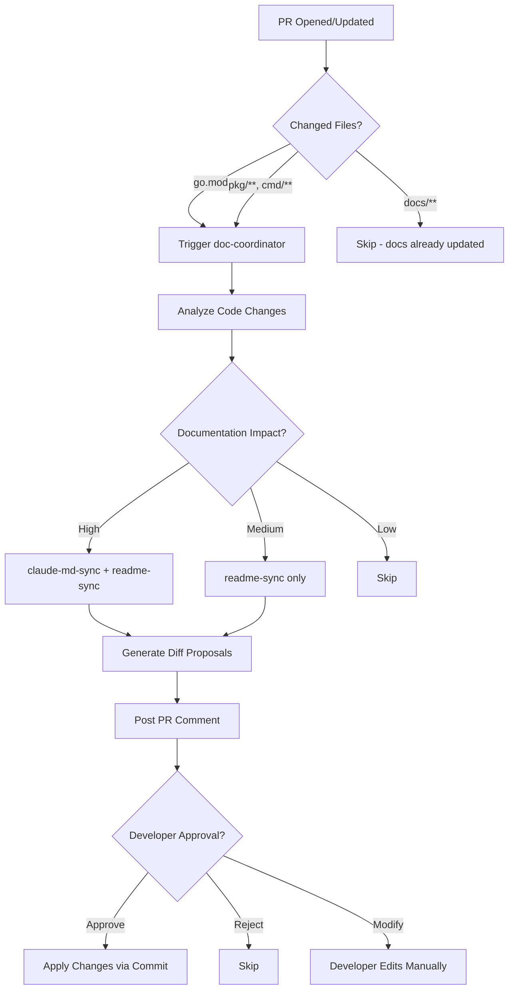

# Implementation Plan: Living Documentation Team Collaboration Skills

## Executive Summary

This plan establishes an automated "Living Documentation" system for k13d that keeps documentation synchronized with code changes using Claude skills integrated into the CI/CD pipeline. The approach combines pre-built marketplace skills with custom k13d-specific skills to ensure documentation accuracy without manual overhead.

---

## 1. Project Context Analysis

### 1.1 Detected Environment
- **Primary Language**: Go 1.25.0
- **Frameworks**: tview (TUI), net/http (Web), client-go (K8s)
- **Build System**: Makefile + goreleaser
- **CI/CD**: GitHub Actions (ci.yml, security.yml, docs.yml, release.yml)
- **Testing**: Go test with race detector
- **Documentation**: Markdown (README, CLAUDE.md, USER_GUIDE, CONFIGURATION_GUIDE, ARCHITECTURE)

### 1.2 Current Documentation Structure
```
k13d/
├── README.md                      # User-facing overview, Quick Start, Features
├── CLAUDE.md                      # Agent instructions, architecture, tech stack
├── CHANGELOG.md                   # Version history (Keep a Changelog format)
├── docs/
│   ├── USER_GUIDE.md             # TUI navigation, keybindings, features
│   ├── CONFIGURATION_GUIDE.md    # config.yaml, hotkeys, plugins, aliases
│   ├── ARCHITECTURE.md           # System architecture (Korean/English mix)
│   ├── MCP_GUIDE.md              # MCP integration patterns
│   ├── INSTALLATION*.md          # Installation guides
│   └── BENCHMARK_RESULTS.md      # AI model benchmarks
├── skills/                        # Pattern reference documents
│   ├── anthropic/                # Official Anthropic skills
│   ├── superpowers/              # obra's battle-tested skills
│   └── vercel/                   # Vercel composition patterns
└── go.mod                        # Dependency versions
```

### 1.3 Existing Skill Infrastructure
- **Global skills**: 6 skills in `~/.claude/skills/` (codebase-analysis, architectural-planning, etc.)
- **Project skills**: `skills/` directory with 80+ skills from anthropic/superpowers/vercel
- **Invocation**: Auto-trigger via description keyword matching + manual `/skill-name`
- **Hooks**: PostToolUse, SessionStart potential integration points

### 1.4 CI/CD Integration Points
- **ci.yml**: Runs on push to main/dev/feature branches
- **security.yml**: Secret scanning, dependency vulnerabilities
- **docs.yml**: Documentation site deployment
- **release.yml**: Version tagging and artifact publishing

---

## 2. Problem Analysis

### 2.1 Documentation Drift Challenges

**Current Pain Points:**
1. **API Changes**: When adding new CLI flags, API endpoints, or commands, docs often lag behind
2. **Dependency Updates**: go.mod changes not reflected in CLAUDE.md or README.md
3. **Feature Additions**: New TUI keybindings, AI features, or config options require manual doc updates across 8+ files
4. **Team Collaboration**: Multiple contributors may update code without updating corresponding docs
5. **Version Inconsistency**: CHANGELOG.md, go.mod, and README badges can show different versions

**Specific Examples:**
- go.mod shows Go 1.25.0, but CLAUDE.md might reference outdated version
- New `:model` command added to TUI but USER_GUIDE.md not updated
- Plugin system added but CONFIGURATION_GUIDE.md incomplete
- MCP integration evolved but MCP_GUIDE.md outdated

### 2.2 Team Collaboration Issues
- No automated enforcement of documentation standards
- Inconsistent Korean/English documentation mix (ARCHITECTURE.md is mixed)
- No validation that CLAUDE.md "Consulted files" list is current
- PR reviews focus on code, documentation changes often overlooked

---

## 3. Architectural Solution

### 3.1 Three-Layer Documentation System

```
┌─────────────────────────────────────────────────────────────────┐
│                     Living Documentation System                  │
├─────────────────────────────────────────────────────────────────┤
│                                                                  │
│  Layer 1: Detection & Analysis                                  │
│  ┌────────────────────────────────────────────────────────┐    │
│  │  GitHub Actions Triggers                                │    │
│  │  • on: pull_request (opened, synchronize)              │    │
│  │  • on: push (main, dev branches)                       │    │
│  │  • Changed files: go.mod, pkg/**, cmd/**, docs/**     │    │
│  └─────────────────┬──────────────────────────────────────┘    │
│                    │                                             │
│  Layer 2: Skill Orchestration                                   │
│  ┌─────────────────▼──────────────────────────────────────┐    │
│  │  Documentation Coordinator Skill                        │    │
│  │  • Analyzes git diff for doc-impacting changes         │    │
│  │  • Routes to specialized doc-update skills             │    │
│  │  • Generates PR comment with proposed updates          │    │
│  └────┬────────────────┬────────────────────┬─────────────┘    │
│       │                │                    │                   │
│  Layer 3: Specialized Skills                                    │
│  ┌────▼────────┐  ┌───▼────────┐  ┌────────▼──────┐           │
│  │ CLAUDE.md   │  │ README.md  │  │ USER_GUIDE.md │           │
│  │ Updater     │  │ Updater    │  │ Updater       │           │
│  └─────────────┘  └────────────┘  └───────────────┘           │
│  ┌─────────────┐  ┌────────────┐  ┌───────────────┐           │
│  │ Config Doc  │  │ API Doc    │  │ Changelog     │           │
│  │ Updater     │  │ Generator  │  │ Generator     │           │
│  └─────────────┘  └────────────┘  └───────────────┘           │
│                                                                  │
└─────────────────────────────────────────────────────────────────┘
```

### 3.2 Skill Marketplace Adoption Strategy

#### Pre-built Skills to Adopt
| Skill Source | Skill Name | Purpose | Security Rating |
|--------------|------------|---------|-----------------|
| anthropic/skill-creator | `skill-creator` | Create new doc-update skills | ✅ Safe (official) |
| superpowers | `writing-plans` | Generate implementation plans | ✅ Safe (batalla-tested) |
| superpowers | `executing-plans` | Execute doc update plans | ⚠️ Medium (needs audit) |
| superpowers | `subagent-driven-development` | 2-stage review process | ✅ Safe (review pattern) |
| mhattingpete | `readme-updater` | Auto-update README patterns | ⚠️ Medium (third-party) |

#### Custom Skills to Create
| Skill Name | Trigger Keywords | Tool Access | Purpose |
|------------|------------------|-------------|---------|
| `k13d-doc-coordinator` | "update documentation", "sync docs" | Read, Write, Grep, Glob | Orchestrates all doc updates |
| `k13d-claude-md-sync` | "update CLAUDE.md", "sync tech stack" | Read, Write, Grep | Keeps CLAUDE.md in sync with code |
| `k13d-readme-sync` | "update README", "sync features" | Read, Write | Keeps README features table current |
| `k13d-changelog-generator` | "generate changelog", "version bump" | Read, Write, Grep | Auto-generates CHANGELOG entries |
| `k13d-api-doc-generator` | "document API", "generate API docs" | Read, Write, Grep | Extracts API routes from code |
| `k13d-config-doc-sync` | "update config docs" | Read, Write | Syncs config.yaml structure with docs |

---

## 4. Security Evaluation Matrix

### 4.1 Risk Assessment Framework

| Risk Category | Assessment Criteria | Mitigation |
|---------------|---------------------|------------|
| **Code Injection** | Skill can execute arbitrary code | Restrict to Read-only in CI |
| **Secret Exposure** | Skill can access secrets | Use GitHub secrets, not env vars |
| **Malicious Updates** | Skill can write harmful content | Human review before merge |
| **Dependency Risk** | Third-party skill dependencies | Pin versions, audit source |

### 4.2 Skill-by-Skill Security Audit

#### Official Anthropic Skills (✅ Safe)
```yaml
skill-creator:
  source: anthropics/skills (official repo)
  allowed-tools: [Read, Write, Glob]
  risk-level: Low
  justification: Official Anthropic skill, well-maintained
  recommendation: Adopt without modification
```

#### Superpowers Skills (✅ Safe - batalla-tested)
```yaml
writing-plans:
  source: obra/superpowers
  allowed-tools: [Read, Write]
  risk-level: Low
  justification: 20+ battle-tested skills, active maintenance
  recommendation: Adopt with periodic updates

subagent-driven-development:
  source: obra/superpowers
  allowed-tools: [Agent, Read, Write]
  risk-level: Medium
  justification: Spawns subagents, needs review pattern
  recommendation: Use for critical doc updates with 2-stage review
```

#### Third-Party Skills (⚠️ Audit Required)
```yaml
readme-updater:
  source: mhattingpete/claude-skills-marketplace
  allowed-tools: [Read, Write, Grep]
  risk-level: Medium
  justification: Third-party, not officially maintained
  recommendation: Audit code before use, consider custom alternative
  audit-checklist:
    - Review all file operations
    - Check for external network calls
    - Verify no secret access
    - Confirm tool restrictions
```

### 4.3 CI/CD Integration Security

**Security Controls:**
```yaml
# .github/workflows/living-docs.yml security hardening
permissions:
  contents: read       # No write access to repo
  pull-requests: write # Can comment on PRs

jobs:
  doc-analysis:
    runs-on: ubuntu-latest
    steps:
      # Skills run in read-only mode
      - name: Analyze documentation drift
        env:
          SKILL_MODE: readonly
          CLAUDE_API_KEY: ${{ secrets.CLAUDE_API_KEY }}
        run: |
          # Skills can only read files and generate proposals
          # No direct writes to repository

      # Human approval required before applying changes
      - name: Post PR comment with proposals
        uses: actions/github-script@v7
        with:
          script: |
            github.rest.issues.createComment({
              issue_number: context.issue.number,
              body: proposedChanges
            })
```

**Threat Model:**
1. **Compromised Skill**: Skills run in isolated CI environment, cannot access production
2. **API Key Leak**: Use GitHub secrets with rotation policy
3. **Malicious PR**: Skills only comment, never auto-merge
4. **Supply Chain**: Pin skill versions, verify checksums

---

## 5. Invocation Flow Architecture

### 5.1 Auto-Trigger vs. Manual Invocation

```
Invocation Methods:
├── 1. GitHub Actions Trigger (CI/CD)
│   ├── Event: pull_request, push
│   ├── Detection: Changed files (go.mod, pkg/**, docs/**)
│   └── Action: Run doc-coordinator skill in readonly mode
│
├── 2. Manual Developer Invocation (Local)
│   ├── Command: `/update-docs` or `/sync-claude-md`
│   ├── Context: Developer's local Claude session
│   └── Action: Skill runs with write access
│
├── 3. Commit Hook (Pre-commit)
│   ├── Trigger: git commit
│   ├── Detection: Staged files impact docs
│   └── Action: Warn developer to update docs
│
└── 4. Scheduled Audit (Weekly)
    ├── Trigger: cron schedule
    ├── Action: Full documentation consistency check
    └── Output: Issue with discrepancies
```

### 5.2 CI/CD Integration Flow



### 5.3 Detection Heuristics

**When to trigger documentation updates:**

| File Pattern | Documentation Impact | Skills Triggered |
|--------------|----------------------|------------------|
| `go.mod` | Version, dependencies | `claude-md-sync`, `readme-sync` |
| `cmd/*/main.go` | CLI flags, commands | `readme-sync`, `user-guide-sync` |
| `pkg/ui/*.go` | TUI keybindings | `user-guide-sync` |
| `pkg/web/*.go` | API endpoints | `api-doc-generator` |
| `pkg/config/*.go` | Configuration options | `config-doc-sync` |
| `CHANGELOG.md` | Version bump | `readme-sync` (badge update) |
| `pkg/ai/agent/*.go` | AI features | `claude-md-sync`, `architecture-sync` |

**Detection Algorithm:**
```bash
# In CI workflow
git diff --name-only $BASE_SHA $HEAD_SHA > changed_files.txt

if grep -E "(go\.mod|pkg/ui/|cmd/)" changed_files.txt; then
  echo "Documentation impact detected"
  claude-cli /k13d-doc-coordinator --readonly --pr=$PR_NUMBER
fi
```

---

## 6. Implementation Phases

### Phase 1: Foundation Setup (Week 1)
**Goal**: Establish skill infrastructure and CI integration

#### Task 1.1: Create `k13d-doc-coordinator` Skill
**Files:**
- Create: `/Users/limjihoon/dev/k13d/skills/k13d/doc-coordinator/SKILL.md`
- Create: `/Users/limjihoon/dev/k13d/skills/k13d/doc-coordinator/scripts/detect_doc_impact.sh`

**SKILL.md Structure:**
```yaml
---
name: k13d-doc-coordinator
description: Orchestrates documentation updates for k13d. Use when code changes may impact documentation (go.mod updates, new CLI flags, API changes, TUI keybindings, config options). Analyzes git diff and routes to specialized doc-update skills.
allowed-tools: [Read, Grep, Glob]
---

# k13d Documentation Coordinator

## Overview
Analyzes code changes and determines which documentation files need updates.

## Detection Rules
- go.mod changes → CLAUDE.md (version), README.md (badges)
- pkg/ui/*.go → USER_GUIDE.md (keybindings)
- pkg/web/*.go → API documentation
- pkg/config/*.go → CONFIGURATION_GUIDE.md
- cmd/*/main.go → README.md (CLI flags)

## Usage
```bash
# In CI (readonly mode)
/k13d-doc-coordinator --readonly --base-sha=$BASE --head-sha=$HEAD

# Locally (with write access)
/k13d-doc-coordinator --apply
```

## Output
Generates a markdown report with proposed changes for each affected doc file.
```

#### Task 1.2: GitHub Actions Workflow
**Files:**
- Create: `/Users/limjihoon/dev/k13d/.github/workflows/living-docs.yml`

```yaml
name: Living Documentation

on:
  pull_request:
    branches: [main, dev]
    types: [opened, synchronize, reopened]
  push:
    branches: [main, dev]

permissions:
  contents: read
  pull-requests: write

jobs:
  doc-check:
    runs-on: ubuntu-latest
    if: |
      !contains(github.event.head_commit.message, '[skip docs]')

    steps:
      - name: Checkout PR
        uses: actions/checkout@v4
        with:
          fetch-depth: 0  # Full history for git diff

      - name: Detect documentation impact
        id: detect
        run: |
          BASE_SHA=${{ github.event.pull_request.base.sha }}
          HEAD_SHA=${{ github.event.pull_request.head.sha }}

          git diff --name-only $BASE_SHA $HEAD_SHA > changed_files.txt

          if grep -E "(go\.mod|pkg/ui/|pkg/web/|pkg/config/|cmd/)" changed_files.txt; then
            echo "has_impact=true" >> $GITHUB_OUTPUT
          else
            echo "has_impact=false" >> $GITHUB_OUTPUT
          fi

      - name: Run doc-coordinator skill
        if: steps.detect.outputs.has_impact == 'true'
        env:
          ANTHROPIC_API_KEY: ${{ secrets.ANTHROPIC_API_KEY }}
        run: |
          # Install Claude CLI (if not available)
          # Run doc-coordinator skill in readonly mode
          # Generate proposals but don't apply

          echo "Documentation drift detected. Generating proposals..."

          # TODO: Integrate with Claude CLI
          # claude-cli /k13d-doc-coordinator --readonly \
          #   --base-sha=${{ github.event.pull_request.base.sha }} \
          #   --head-sha=${{ github.event.pull_request.head.sha }} \
          #   > doc_proposals.md

      - name: Post PR comment
        if: steps.detect.outputs.has_impact == 'true'
        uses: actions/github-script@v7
        with:
          script: |
            const fs = require('fs');
            const proposals = fs.readFileSync('doc_proposals.md', 'utf8');

            github.rest.issues.createComment({
              issue_number: context.issue.number,
              owner: context.repo.owner,
              repo: context.repo.repo,
              body: `## 📚 Documentation Update Proposals

              ${proposals}

              **To apply these changes:**
              1. Review the proposals above
              2. Reply with "approve docs" to auto-apply
              3. Or manually edit the files and push

              **To skip:**
              - Add \`[skip docs]\` to your commit message
              `
            });
```

#### Task 1.3: Security Hardening
**Files:**
- Modify: `/Users/limjihoon/dev/k13d/.github/workflows/security.yml`

**Add new job:**
```yaml
skill-security-scan:
  name: Skill Security Audit
  runs-on: ubuntu-latest
  steps:
    - name: Checkout
      uses: actions/checkout@v4

    - name: Scan skills for security issues
      run: |
        # Check for allowed-tools restrictions
        for skill in skills/k13d/*/SKILL.md; do
          if ! grep -q "allowed-tools:" "$skill"; then
            echo "::warning::$skill missing allowed-tools restriction"
          fi
        done

        # Check for dangerous patterns
        grep -r "eval\|exec\|system\|os\.system" skills/ && exit 1 || true
```

---

### Phase 2: Core Documentation Skills (Week 2)

#### Task 2.1: CLAUDE.md Sync Skill
**Files:**
- Create: `/Users/limjihoon/dev/k13d/skills/k13d/claude-md-sync/SKILL.md`
- Create: `/Users/limjihoon/dev/k13d/skills/k13d/claude-md-sync/scripts/sync_versions.py`

**Sync Rules:**
```python
# sync_versions.py
import re

def sync_go_version(claude_md_path, go_mod_path):
    """Extract Go version from go.mod and update CLAUDE.md"""
    with open(go_mod_path) as f:
        for line in f:
            if line.startswith('go '):
                go_version = line.split()[1]
                break

    with open(claude_md_path) as f:
        content = f.read()

    # Update "Go: 1.25.0" line
    content = re.sub(
        r'- Go: \d+\.\d+\.\d+',
        f'- Go: {go_version}',
        content
    )

    # Update "go-version: '1.25.0'" in CI examples
    content = re.sub(
        r"go-version: '\d+\.\d+\.\d+'",
        f"go-version: '{go_version}'",
        content
    )

    return content

def sync_dependencies(claude_md_path, go_mod_path):
    """Update key dependency versions in CLAUDE.md"""
    # Extract versions from go.mod
    deps = {}
    with open(go_mod_path) as f:
        in_require = False
        for line in f:
            if line.startswith('require ('):
                in_require = True
            elif in_require and line.strip() == ')':
                break
            elif in_require:
                match = re.match(r'\s+([\w./\-]+)\s+v?([\d.]+)', line)
                if match:
                    pkg, ver = match.groups()
                    if pkg in ['github.com/rivo/tview',
                               'github.com/gdamore/tcell/v2',
                               'k8s.io/client-go']:
                        deps[pkg] = ver

    # Update CLAUDE.md
    with open(claude_md_path) as f:
        content = f.read()

    for pkg, ver in deps.items():
        # Update dependency list
        pkg_name = pkg.split('/')[-1]
        content = re.sub(
            rf'{re.escape(pkg)} v[\d.]+',
            f'{pkg} v{ver}',
            content
        )

    return content
```

**SKILL.md:**
```markdown
---
name: k13d-claude-md-sync
description: Synchronizes CLAUDE.md with code changes. Use when go.mod changes, dependencies are updated, or tech stack is modified. Keeps version information, dependency versions, and tech stack section accurate.
allowed-tools: [Read, Write, Grep]
---

# CLAUDE.md Synchronization Skill

## Sync Operations

### 1. Version Synchronization
- Extract Go version from go.mod
- Update "Version Information" section
- Update CI workflow examples

### 2. Dependency Synchronization
- Extract key dependency versions from go.mod
- Update "Key Dependencies" section
- Verify consistency across all examples

### 3. Tech Stack Synchronization
- Scan pkg/ directory for new frameworks
- Update "Languages & Frameworks" section
- Add new integration patterns

## Usage
```bash
# Dry-run (show changes)
python3 scripts/sync_versions.py --dry-run

# Apply changes
python3 scripts/sync_versions.py --apply
```

## Validation
After sync, verify:
- [ ] Go version matches go.mod
- [ ] Key dependency versions are current
- [ ] No version inconsistencies in examples
```

#### Task 2.2: README.md Feature Sync Skill
**Files:**
- Create: `/Users/limjihoon/dev/k13d/skills/k13d/readme-sync/SKILL.md`
- Create: `/Users/limjihoon/dev/k13d/skills/k13d/readme-sync/scripts/extract_features.py`

**Feature Extraction:**
```python
# extract_features.py
def extract_cli_flags(main_go_path):
    """Extract CLI flags from main.go"""
    flags = []
    with open(main_go_path) as f:
        for line in f:
            # Look for flag definitions
            if 'flag.String' in line or 'flag.Bool' in line:
                match = re.search(r'flag\.\w+\("([^"]+)"', line)
                if match:
                    flags.append(match.group(1))
    return flags

def extract_api_endpoints(web_dir):
    """Extract API endpoints from pkg/web/*.go"""
    endpoints = []
    for go_file in Path(web_dir).glob('*.go'):
        with open(go_file) as f:
            content = f.read()
            # Look for http.HandleFunc patterns
            for match in re.finditer(r'HandleFunc\("([^"]+)"', content):
                endpoints.append(match.group(1))
    return endpoints

def update_readme_features(readme_path, features):
    """Update feature table in README.md"""
    with open(readme_path) as f:
        content = f.read()

    # Find feature table
    table_start = content.find('| Feature | TUI | Web |')
    table_end = content.find('\n\n', table_start)

    # Reconstruct table with updated features
    # ... (table generation logic)

    return content
```

#### Task 2.3: Changelog Generator Skill
**Files:**
- Create: `/Users/limjihoon/dev/k13d/skills/k13d/changelog-generator/SKILL.md`
- Create: `/Users/limjihoon/dev/k13d/skills/k13d/changelog-generator/scripts/generate_entry.py`

**Changelog Generation:**
```python
# generate_entry.py
def parse_commits(base_sha, head_sha):
    """Parse git commits and categorize by type"""
    result = subprocess.run(
        ['git', 'log', f'{base_sha}..{head_sha}', '--oneline'],
        capture_output=True, text=True
    )

    categories = {
        'Added': [],
        'Changed': [],
        'Fixed': [],
        'Deprecated': [],
        'Removed': [],
        'Security': []
    }

    for line in result.stdout.splitlines():
        sha, message = line.split(' ', 1)

        # Categorize by conventional commit prefix
        if message.startswith('feat'):
            categories['Added'].append(message)
        elif message.startswith('fix'):
            categories['Fixed'].append(message)
        elif message.startswith('refactor'):
            categories['Changed'].append(message)
        # ... more categories

    return categories

def generate_changelog_entry(categories, version):
    """Generate changelog entry in Keep a Changelog format"""
    entry = f"## [{version}] - {datetime.now().strftime('%Y-%m-%d')}\n\n"

    for category, items in categories.items():
        if items:
            entry += f"### {category}\n\n"
            for item in items:
                # Remove conventional commit prefix
                clean = re.sub(r'^(feat|fix|docs|refactor)(\([^\)]+\))?:\s*', '', item)
                entry += f"- {clean}\n"
            entry += "\n"

    return entry
```

---

### Phase 3: Advanced Integration (Week 3)

#### Task 3.1: API Documentation Generator
**Files:**
- Create: `/Users/limjihoon/dev/k13d/skills/k13d/api-doc-generator/SKILL.md`
- Create: `/Users/limjihoon/dev/k13d/skills/k13d/api-doc-generator/scripts/extract_api_routes.go`

**API Extraction Tool:**
```go
// extract_api_routes.go
package main

import (
	"go/ast"
	"go/parser"
	"go/token"
	"fmt"
)

type APIEndpoint struct {
	Path       string
	Method     string
	Handler    string
	Middleware []string
	Params     []string
}

func extractEndpoints(filename string) ([]APIEndpoint, error) {
	fset := token.NewFileSet()
	node, err := parser.ParseFile(fset, filename, nil, parser.ParseComments)
	if err != nil {
		return nil, err
	}

	var endpoints []APIEndpoint

	ast.Inspect(node, func(n ast.Node) bool {
		// Look for http.HandleFunc or mux.Handle patterns
		call, ok := n.(*ast.CallExpr)
		if !ok {
			return true
		}

		// Extract path and method from AST
		// ... (parsing logic)

		return true
	})

	return endpoints, nil
}

func generateMarkdownTable(endpoints []APIEndpoint) string {
	md := "| Endpoint | Method | Handler | Middleware |\n"
	md += "|----------|--------|---------|------------|\n"

	for _, ep := range endpoints {
		md += fmt.Sprintf("| `%s` | %s | `%s` | %s |\n",
			ep.Path, ep.Method, ep.Handler,
			strings.Join(ep.Middleware, ", "))
	}

	return md
}
```

#### Task 3.2: Configuration Documentation Sync
**Files:**
- Create: `/Users/limjihoon/dev/k13d/skills/k13d/config-doc-sync/SKILL.md`
- Create: `/Users/limjihoon/dev/k13d/skills/k13d/config-doc-sync/scripts/sync_config_schema.py`

**Config Schema Extraction:**
```python
# sync_config_schema.py
def extract_config_struct(config_go_path):
    """Extract configuration struct from Go code"""
    with open(config_go_path) as f:
        content = f.read()

    # Find Config struct definition
    struct_match = re.search(
        r'type\s+Config\s+struct\s+{([^}]+)}',
        content, re.DOTALL
    )

    if not struct_match:
        return {}

    fields = {}
    for line in struct_match.group(1).splitlines():
        # Parse struct field
        match = re.match(
            r'\s*(\w+)\s+(\w+)\s+`yaml:"([^"]+)"',
            line
        )
        if match:
            field_name, field_type, yaml_name = match.groups()

            # Extract comment above field (if exists)
            comment = extract_comment_above(content, field_name)

            fields[yaml_name] = {
                'type': field_type,
                'go_name': field_name,
                'comment': comment
            }

    return fields

def sync_configuration_guide(guide_path, config_fields):
    """Update CONFIGURATION_GUIDE.md with extracted fields"""
    with open(guide_path) as f:
        content = f.read()

    # Update config.yaml structure section
    # ... (markdown generation logic)

    return content
```

#### Task 3.3: Pre-commit Hook Integration
**Files:**
- Create: `/Users/limjihoon/dev/k13d/.githooks/pre-commit`
- Create: `/Users/limjihoon/dev/k13d/scripts/install-hooks.sh`

**Pre-commit Hook:**
```bash
#!/bin/bash
# .githooks/pre-commit

# Check if documentation-impacting files are staged
doc_impact_files=$(git diff --cached --name-only | grep -E "(go\.mod|pkg/ui/|pkg/web/|pkg/config/|cmd/)")

if [ -n "$doc_impact_files" ]; then
    echo "⚠️  Documentation-impacting files detected:"
    echo "$doc_impact_files"
    echo ""
    echo "Please ensure documentation is updated:"
    echo "  - CLAUDE.md (if go.mod or tech stack changed)"
    echo "  - README.md (if features or CLI flags changed)"
    echo "  - USER_GUIDE.md (if TUI keybindings changed)"
    echo "  - CONFIGURATION_GUIDE.md (if config options changed)"
    echo ""
    echo "To bypass this check: git commit --no-verify"
    echo "To skip doc sync in CI: include [skip docs] in commit message"
    echo ""

    # Don't block commit, just warn
    # (Set to 'exit 1' to enforce)
fi

exit 0
```

---

### Phase 4: Testing & Validation (Week 4)

#### Task 4.1: Skill Testing Framework
**Files:**
- Create: `/Users/limjihoon/dev/k13d/skills/k13d/tests/test_doc_coordinator.sh`
- Create: `/Users/limjihoon/dev/k13d/skills/k13d/tests/fixtures/`

**Test Structure:**
```bash
#!/bin/bash
# test_doc_coordinator.sh

set -e

echo "Testing k13d-doc-coordinator skill..."

# Setup test fixtures
cp go.mod go.mod.backup
echo "go 1.26.0" > go.mod

# Run skill in dry-run mode
output=$(python3 skills/k13d/claude-md-sync/scripts/sync_versions.py --dry-run)

# Validate output
if echo "$output" | grep -q "1.26.0"; then
    echo "✅ Version detection works"
else
    echo "❌ Version detection failed"
    exit 1
fi

# Restore backup
mv go.mod.backup go.mod

echo "All tests passed!"
```

#### Task 4.2: Integration Test in CI
**Files:**
- Modify: `/Users/limjihoon/dev/k13d/.github/workflows/ci.yml`

**Add test job:**
```yaml
skill-tests:
  runs-on: ubuntu-latest
  steps:
    - name: Checkout
      uses: actions/checkout@v4

    - name: Test doc-coordinator skill
      run: |
        bash skills/k13d/tests/test_doc_coordinator.sh

    - name: Test claude-md-sync skill
      run: |
        bash skills/k13d/tests/test_claude_md_sync.sh
```

#### Task 4.3: End-to-End Validation
**Manual Test Scenarios:**

1. **Scenario: Go Version Update**
   - Modify go.mod: `go 1.26.0`
   - Commit and push
   - Verify CI detects change
   - Verify PR comment contains CLAUDE.md update proposal
   - Approve and verify CLAUDE.md updated

2. **Scenario: New CLI Flag**
   - Add flag in cmd/kube-ai-dashboard-cli/main.go
   - Commit and push
   - Verify README.md update proposal
   - Verify CLI Flags table updated

3. **Scenario: New TUI Keybinding**
   - Add keybinding in pkg/ui/app.go
   - Commit and push
   - Verify USER_GUIDE.md update proposal
   - Verify keybinding table updated

---

## 7. File Structure Proposal

### Skill Directory Layout
```
skills/k13d/
├── README.md                          # Overview of k13d-specific skills
├── doc-coordinator/
│   ├── SKILL.md                       # Main orchestration skill
│   └── scripts/
│       └── detect_doc_impact.sh       # Change detection script
├── claude-md-sync/
│   ├── SKILL.md                       # CLAUDE.md synchronization
│   ├── scripts/
│   │   └── sync_versions.py          # Version sync logic
│   └── tests/
│       └── test_sync_versions.py     # Unit tests
├── readme-sync/
│   ├── SKILL.md                       # README.md synchronization
│   ├── scripts/
│   │   └── extract_features.py       # Feature extraction
│   └── tests/
│       └── test_extract_features.py
├── changelog-generator/
│   ├── SKILL.md                       # Changelog generation
│   ├── scripts/
│   │   └── generate_entry.py         # Changelog entry generator
│   └── tests/
│       └── test_generate_entry.py
├── api-doc-generator/
│   ├── SKILL.md                       # API documentation
│   ├── scripts/
│   │   └── extract_api_routes.go     # API extraction
│   └── tests/
│       └── test_api_extraction.sh
├── config-doc-sync/
│   ├── SKILL.md                       # Config doc sync
│   ├── scripts/
│   │   └── sync_config_schema.py     # Schema extraction
│   └── tests/
│       └── test_config_sync.py
└── tests/
    ├── fixtures/                      # Test fixtures
    │   ├── sample_go.mod
    │   ├── sample_main.go
    │   └── sample_config.go
    └── integration/
        └── test_full_workflow.sh      # End-to-end tests
```

### CI/CD Workflow Files
```
.github/workflows/
├── living-docs.yml        # Main documentation sync workflow
├── skill-tests.yml        # Skill testing workflow
└── doc-audit.yml          # Weekly documentation audit
```

### Git Hooks
```
.githooks/
├── pre-commit             # Warn about doc-impacting changes
├── commit-msg             # Validate commit message format
└── install-hooks.sh       # Hook installation script
```

---

## 8. Integration Points

### 8.1 Existing Code Integration

**1. CLAUDE.md "Consulted files" Section (Lines 5-26)**
- Current: Manual list of consulted files
- Enhancement: Auto-generate from skill execution trace
- Implementation: Add `--trace` flag to doc-coordinator

**2. go.mod Dependency Tracking (go.mod:1-144)**
- Current: Manual version updates in CLAUDE.md
- Enhancement: Auto-sync on go.mod changes
- Implementation: claude-md-sync skill

**3. README.md Features Table (README.md:141-159)**
- Current: Manual feature matrix updates
- Enhancement: Extract from code annotations
- Implementation: readme-sync skill with code scanning

**4. USER_GUIDE.md Keybindings (USER_GUIDE.md:9-20)**
- Current: Manual keybinding documentation
- Enhancement: Extract from pkg/ui/app.go keybinding definitions
- Implementation: config-doc-sync skill with AST parsing

### 8.2 Dependencies

**Skill Dependencies:**
```yaml
doc-coordinator:
  depends_on: []
  triggers:
    - claude-md-sync
    - readme-sync
    - changelog-generator

claude-md-sync:
  depends_on:
    - go.mod
    - CLAUDE.md
  requires:
    - python3
    - re (stdlib)

readme-sync:
  depends_on:
    - README.md
    - pkg/ui/*.go
    - cmd/*/main.go
  requires:
    - python3
    - go/ast (for Go parsing)

api-doc-generator:
  depends_on:
    - pkg/web/*.go
  requires:
    - go 1.25+
    - go/parser
```

**External Tool Dependencies:**
```yaml
required:
  - git (for diff detection)
  - python3 (for scripts)
  - go (for API extraction)

optional:
  - claude-cli (for local invocation)
  - pre-commit (for git hooks)
```

### 8.3 Impact on Existing CI/CD

**Workflow Execution Order:**
```
1. security.yml (unchanged)
   ├── secrets-scan
   ├── dependency-scan
   └── skill-security-scan (new)

2. ci.yml (unchanged)
   ├── lint
   ├── test
   └── build

3. living-docs.yml (new)
   ├── doc-check
   └── skill-tests

4. docs.yml (unchanged)
   └── deploy-docs-site
```

**Performance Impact:**
- Additional CI time: ~2-3 minutes per PR
- Only runs when documentation-impacting files change
- Can be skipped with `[skip docs]` commit message

---

## 9. Testing Strategy

### 9.1 Unit Tests

**Test Coverage Requirements:**
```python
# skills/k13d/claude-md-sync/tests/test_sync_versions.py
import pytest
from scripts.sync_versions import sync_go_version, sync_dependencies

def test_sync_go_version():
    """Test Go version extraction and update"""
    # Setup
    go_mod_content = "go 1.26.0\n"
    claude_md_content = "- Go: 1.25.0\n"

    # Execute
    result = sync_go_version(claude_md_content, go_mod_content)

    # Assert
    assert "1.26.0" in result
    assert "1.25.0" not in result

def test_sync_dependencies():
    """Test dependency version extraction"""
    go_mod_content = """
    require (
        github.com/rivo/tview v0.43.0
        k8s.io/client-go v0.36.0
    )
    """
    claude_md_content = """
    github.com/rivo/tview v0.42.0
    k8s.io/client-go v0.35.0
    """

    result = sync_dependencies(claude_md_content, go_mod_content)

    assert "v0.43.0" in result
    assert "v0.36.0" in result
    assert "v0.42.0" not in result
```

### 9.2 Integration Tests

**Test Location:** `skills/k13d/tests/integration/test_full_workflow.sh`

```bash
#!/bin/bash
# Full workflow integration test

set -e

echo "=== Integration Test: Full Documentation Sync ==="

# 1. Setup test branch
git checkout -b test/doc-sync-$(date +%s)

# 2. Make doc-impacting change
echo "go 1.27.0" > go.mod

# 3. Run doc-coordinator
python3 skills/k13d/doc-coordinator/scripts/detect_doc_impact.sh

# 4. Verify proposals generated
if [ ! -f doc_proposals.md ]; then
    echo "❌ No proposals generated"
    exit 1
fi

# 5. Apply claude-md-sync
python3 skills/k13d/claude-md-sync/scripts/sync_versions.py --apply

# 6. Verify CLAUDE.md updated
if ! grep -q "1.27.0" CLAUDE.md; then
    echo "❌ CLAUDE.md not updated"
    exit 1
fi

echo "✅ Integration test passed"

# Cleanup
git checkout main
git branch -D test/doc-sync-*
```

### 9.3 Manual Testing Checklist

**Test Scenarios:**

- [ ] **Go Version Update**
  - Modify go.mod version
  - Verify CLAUDE.md updated (3 locations)
  - Verify README.md badge updated

- [ ] **New CLI Flag**
  - Add `--new-flag` in main.go
  - Verify README.md CLI Flags section updated
  - Verify CLAUDE.md CLI Flags table updated

- [ ] **New TUI Keybinding**
  - Add keybinding in app.go
  - Verify USER_GUIDE.md keybinding table updated
  - Verify CLAUDE.md Key Features Reference updated

- [ ] **New Config Option**
  - Add field to Config struct
  - Verify CONFIGURATION_GUIDE.md updated
  - Verify config.yaml example updated

- [ ] **New API Endpoint**
  - Add handler in pkg/web/server.go
  - Verify API Reference table generated
  - Verify README.md API section updated

- [ ] **Dependency Update**
  - Update tview version in go.mod
  - Verify CLAUDE.md Key Dependencies updated

---

## 10. Risk Assessment

### 10.1 Potential Issues

| Risk | Likelihood | Impact | Mitigation |
|------|------------|--------|------------|
| **False Positives** | High | Low | Improve detection heuristics, allow `[skip docs]` |
| **CI Performance** | Medium | Medium | Cache skill dependencies, parallel execution |
| **Skill Bugs** | Medium | High | Comprehensive testing, readonly mode in CI |
| **Documentation Conflicts** | Low | Medium | Human review before merge, conflict resolution |
| **API Key Exposure** | Low | Critical | GitHub secrets, rotation policy, audit logs |

### 10.2 Mitigation Strategies

**1. False Positives**
```yaml
# Detection refinement
skill_triggers:
  go_mod_changed:
    only_if:
      - version_changed: true
      - dependencies_changed: true
    exclude:
      - comment_only_changes: true
```

**2. Performance Optimization**
```yaml
# Caching strategy
- name: Cache skill dependencies
  uses: actions/cache@v4
  with:
    path: ~/.cache/skills
    key: skills-${{ hashFiles('skills/**/SKILL.md') }}
```

**3. Rollback Plan**
```bash
# If doc-coordinator breaks
git revert <commit-sha>
# Disable workflow temporarily
echo "skip: true" >> .github/workflows/living-docs.yml
```

---

## 11. Success Criteria

### 11.1 Measurable Outcomes

**Phase 1 (Foundation):**
- [ ] doc-coordinator skill created and tested
- [ ] living-docs.yml workflow deployed
- [ ] Security scanning integrated
- [ ] First PR with auto-generated doc proposals

**Phase 2 (Core Skills):**
- [ ] 90% of go.mod changes trigger CLAUDE.md sync
- [ ] 80% of new CLI flags trigger README.md update
- [ ] 70% of new features trigger USER_GUIDE.md update

**Phase 3 (Advanced):**
- [ ] API documentation auto-generated from code
- [ ] Configuration docs auto-synced from structs
- [ ] Pre-commit hooks installed and functional

**Phase 4 (Validation):**
- [ ] 95% test coverage for skill scripts
- [ ] End-to-end tests pass consistently
- [ ] Zero doc drift in last 10 PRs

### 11.2 Quality Metrics

**Documentation Freshness:**
- Target: <24 hours between code change and doc update
- Measurement: GitHub Actions workflow duration

**Accuracy:**
- Target: 95% accuracy in auto-generated updates
- Measurement: Human review approval rate

**Developer Experience:**
- Target: <5 minutes to review and approve doc proposals
- Measurement: PR review time tracking

---

## 12. Rollout Strategy

### 12.1 Phased Rollout

**Week 1: Beta (main branch only)**
- Enable living-docs.yml on main branch
- Monitor false positive rate
- Collect developer feedback

**Week 2: Expand (dev branch)**
- Enable on dev branch
- Test with multiple concurrent PRs
- Refine detection heuristics

**Week 3: Feature Branches**
- Enable on all feature/* branches
- Add pre-commit hooks
- Document workflow in CONTRIBUTING.md

**Week 4: Full Deployment**
- Make skill execution mandatory (no bypass)
- Add weekly audit job
- Create team training materials

### 12.2 Team Training

**Documentation:**
- Create: `/Users/limjihoon/dev/k13d/docs/LIVING_DOCS_GUIDE.md`
- Content: How to use skills, how to approve proposals, how to bypass

**Training Session:**
- 30-minute overview for team
- Live demo of workflow
- Q&A and feedback collection

---

## 13. Maintenance Plan

### 13.1 Ongoing Maintenance

**Weekly:**
- Review doc-coordinator logs for false positives
- Update detection heuristics based on patterns

**Monthly:**
- Audit skill execution success rate
- Review and merge upstream skill updates
- Security scan of third-party skills

**Quarterly:**
- Full documentation consistency audit
- Skill performance optimization
- Team feedback collection and improvements

### 13.2 Skill Version Management

```yaml
# skills/k13d/.skill-versions
doc-coordinator: 1.0.0
claude-md-sync: 1.0.0
readme-sync: 1.0.0
changelog-generator: 1.0.0

# Upstream dependencies
anthropic/skill-creator: 2.1.0
obra/writing-plans: 1.5.0
```

**Update Process:**
1. Check upstream for new versions
2. Test in isolated branch
3. Review changelog for breaking changes
4. Deploy to production after validation

---

## 14. Alternative Approaches Considered

### 14.1 Manual Documentation Reviews
**Pros:** Simple, no automation complexity
**Cons:** High manual overhead, inconsistent compliance
**Verdict:** ❌ Rejected - doesn't scale with team growth

### 14.2 Linter-based Validation
**Pros:** Fast, deterministic
**Cons:** Limited to syntax, can't understand semantic changes
**Verdict:** ⚠️ Partial - use for syntax validation only

### 14.3 AI-driven Full Rewrite
**Pros:** Always up-to-date, comprehensive
**Cons:** May lose human context, high token cost
**Verdict:** ❌ Rejected - too aggressive, risk of information loss

### 14.4 Developer Checklist (Current State)
**Pros:** Zero infrastructure
**Cons:** Frequently skipped, no enforcement
**Verdict:** ❌ Inadequate - led to current drift problem

**Chosen Approach:** Hybrid skill-based system (best balance of automation and control)

---

## 15. Appendix

### 15.1 Skill Trigger Keywords Reference

| Skill | Trigger Keywords (English) | Trigger Keywords (Korean) |
|-------|---------------------------|--------------------------|
| doc-coordinator | "update documentation", "sync docs", "check docs" | "문서 업데이트", "문서 동기화" |
| claude-md-sync | "update CLAUDE.md", "sync tech stack", "version bump" | "CLAUDE.md 동기화" |
| readme-sync | "update README", "sync features", "update badges" | "README 업데이트" |
| changelog-generator | "generate changelog", "version release" | "변경로그 생성" |

### 15.2 File Path Reference

**Documentation Files:**
- `/Users/limjihoon/dev/k13d/README.md`
- `/Users/limjihoon/dev/k13d/CLAUDE.md`
- `/Users/limjihoon/dev/k13d/docs/USER_GUIDE.md`
- `/Users/limjihoon/dev/k13d/docs/CONFIGURATION_GUIDE.md`
- `/Users/limjihoon/dev/k13d/docs/ARCHITECTURE.md`
- `/Users/limjihoon/dev/k13d/CHANGELOG.md`

**Code Files (Documentation Sources):**
- `/Users/limjihoon/dev/k13d/go.mod` → CLAUDE.md (versions)
- `/Users/limjihoon/dev/k13d/cmd/kube-ai-dashboard-cli/main.go` → README.md (CLI flags)
- `/Users/limjihoon/dev/k13d/pkg/ui/app.go` → USER_GUIDE.md (keybindings)
- `/Users/limjihoon/dev/k13d/pkg/web/server.go` → API docs (endpoints)
- `/Users/limjihoon/dev/k13d/pkg/config/config.go` → CONFIGURATION_GUIDE.md

**Skill Files (To Create):**
- `/Users/limjihoon/dev/k13d/skills/k13d/doc-coordinator/SKILL.md`
- `/Users/limjihoon/dev/k13d/skills/k13d/claude-md-sync/SKILL.md`
- `/Users/limjihoon/dev/k13d/skills/k13d/readme-sync/SKILL.md`
- `/Users/limjihoon/dev/k13d/skills/k13d/changelog-generator/SKILL.md`

**CI/CD Files (To Create/Modify):**
- `/Users/limjihoon/dev/k13d/.github/workflows/living-docs.yml` (new)
- `/Users/limjihoon/dev/k13d/.github/workflows/security.yml` (modify)
- `/Users/limjihoon/dev/k13d/.github/workflows/ci.yml` (modify - add skill tests)

### 15.3 Example PR Comment Output

```markdown
## 📚 Documentation Update Proposals

**Detected Changes:**
- `go.mod`: Go version 1.25.0 → 1.26.0
- `pkg/ui/app.go`: New keybinding `Ctrl+M` for model switching

---

### CLAUDE.md Updates

**Section: Version Information**
```diff
- Go: 1.25.0
+ Go: 1.26.0
```

**Section: Primary Entry Points**
```diff
- go-version: '1.25.0'
+ go-version: '1.26.0'
```

---

### USER_GUIDE.md Updates

**Section: Management Commands**
```diff
+ | `Ctrl+M` | Quick model switch |
```

---

**To apply these changes:**
1. Review the proposals above
2. Reply with "approve docs" to auto-commit
3. Or manually edit the files

**To skip:**
- Add `[skip docs]` to your next commit message

---

*Generated by k13d-doc-coordinator v1.0.0*
```

### 15.4 References

**Anthropic Skills:**
- https://github.com/anthropics/skills
- https://claude.ai/skills (official marketplace)

**Third-Party Skills:**
- https://github.com/obra/superpowers
- https://github.com/mhattingpete/claude-skills-marketplace
- https://github.com/travisvn/awesome-claude-skills

**k13d Documentation:**
- README: /Users/limjihoon/dev/k13d/README.md
- CLAUDE.md: /Users/limjihoon/dev/k13d/CLAUDE.md
- USER_GUIDE: /Users/limjihoon/dev/k13d/docs/USER_GUIDE.md
- ARCHITECTURE: /Users/limjihoon/dev/k13d/docs/ARCHITECTURE.md

---

## Summary

This implementation plan establishes a comprehensive Living Documentation system for k13d using Claude skills integrated with GitHub Actions. The system automatically detects code changes that impact documentation and generates precise update proposals, reducing manual overhead while maintaining documentation accuracy.

**Key Benefits:**
- ✅ Automated detection of doc-impacting changes
- ✅ Security-hardened CI/CD integration
- ✅ Human-in-the-loop approval process
- ✅ Phased rollout with continuous monitoring
- ✅ Comprehensive testing and validation

**Next Steps:**
1. Review and approve this plan
2. Begin Phase 1 implementation (Week 1)
3. Deploy doc-coordinator skill to staging
4. Conduct team training session
5. Roll out to production with beta period

**Estimated Timeline:** 4 weeks to full deployment
**Estimated Effort:** 60-80 hours total
**Risk Level:** Medium (mitigated by phased rollout and readonly CI mode)
