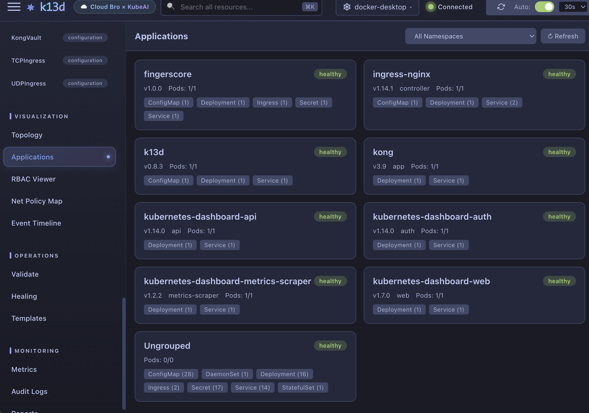

<h1 align="center">k13d</h1>

<p align="center">
  <strong>The all-in-one Kubernetes dashboard — Terminal & Web UI with AI built in.</strong>
</p>

<p align="center">
  <code><b>k</b>ube<b>a</b>i<b>d</b>ashboard</code> — 14 letters — <code><b>k</b></code> + <code>13</code> + <code><b>d</b></code> = <code><b>k13d</b></code>
</p>

<p align="center">
  Download a single binary, run one command, and get a full-featured Kubernetes dashboard<br>
  with an AI assistant that actually executes commands for you.
</p>

<p align="center">
  <a href="https://github.com/cloudbro-kube-ai/k13d/releases"></a>
  
  
  
  
</p>

<p align="center">
  <a href="https://cloudbro-kube-ai.github.io/k13d"><strong>Documentation</strong></a> ·
  <a href="https://github.com/cloudbro-kube-ai/k13d/releases"><strong>Download</strong></a> ·
  <a href="https://cloudbro-kube-ai.github.io/k13d/features/web-ui/"><strong>Web UI Guide</strong></a> ·
  <a href="https://cloudbro-kube-ai.github.io/k13d/features/tui/"><strong>TUI Guide</strong></a> ·
  <a href="https://cloudbro-kube-ai.github.io/k13d/ko/"><strong>한국어</strong></a>
</p>

---

## Web UI

<p align="center">
  
</p>

<table>
  <tr>
    <td width="50%" align="center">
      
      <br><sub><b>Topology View</b> — Resource relationship graph</sub>
    </td>
    <td width="50%" align="center">
      
      <br><sub><b>Applications</b> — App-centric grouped view</sub>
    </td>
  </tr>
  <tr>
    <td align="center">
      
      <br><sub><b>Reports</b> — Cluster health & FinOps analysis</sub>
    </td>
    <td align="center">
      
      <br><sub><b>Metrics</b> — Historical CPU/Memory charts</sub>
    </td>
  </tr>
  <tr>
    <td align="center">
      
      <br><sub><b>Event Timeline</b> — Cluster events by time window</sub>
    </td>
    <td align="center">
      
      <br><sub><b>Network Policy</b> — Ingress/egress visualization</sub>
    </td>
  </tr>
  <tr>
    <td align="center">
      
      <br><sub><b>AI Assistant</b> — Natural language + tool execution</sub>
    </td>
    <td align="center">
      
      <br><sub><b>Pod Terminal</b> — xterm.js shell in browser</sub>
    </td>
  </tr>
  <tr>
    <td align="center">
      
      <br><sub><b>Templates</b> — One-click deploy common patterns</sub>
    </td>
    <td align="center">
      
      <br><sub><b>Settings</b> — LLM, MCP, themes, user management</sub>
    </td>
  </tr>
</table>

## TUI

<table>
  <tr>
    <td width="50%" align="center">
      
      <br><sub><b>Help & Keybindings</b> — k9s-style shortcuts</sub>
    </td>
    <td width="50%" align="center">
      
      <br><sub><b>Autocomplete</b> — Dropdown command suggestions</sub>
    </td>
  </tr>
  <tr>
    <td align="center">
      
      <br><sub><b>LLM Model Switching</b> — Multiple AI profiles</sub>
    </td>
    <td></td>
  </tr>
</table>

---

## Get Started in 30 Seconds

**1. Download** from [Releases](https://github.com/cloudbro-kube-ai/k13d/releases) — single binary, no dependencies.

```bash
tar xzf k13d_*.tar.gz && chmod +x k13d
```

> macOS: if blocked, run `xattr -d com.apple.quarantine ./k13d`

**2. Run.**

```bash
# Web UI
./k13d -web -auth-mode local
# Open http://localhost:8080 (admin / admin)

# TUI
./k13d
```

That's it. Your kubeconfig is auto-detected.

---

## Why k13d?

| | k13d | k9s | Lens | kubectl |
|---|:---:|:---:|:---:|:---:|
| Terminal UI | **Yes** | Yes | - | - |
| Web UI | **Yes** | - | Yes | - |
| AI Assistant | **Yes** | - | - | - |
| Single binary, zero deps | **Yes** | Yes | - | Yes |
| Free & open source | **Yes** | Yes | Paid | Yes |

### Web UI — Everything in the browser

- **Dashboard** — Pods, Deployments, Services, all resources with real-time status
- **AI Assistant** — Ask questions, AI executes kubectl with your approval
- **Topology** — Graph & tree visualization of resource relationships
- **Reports** — Cluster health, security audit, FinOps cost analysis
- **Metrics** — Historical CPU/Memory/Pods/Nodes charts (SQLite-backed)
- **Helm** — Release management, history, rollback
- **Terminal** — Full xterm.js shell into any pod
- **Logs** — Real-time streaming with ANSI colors, search, download
- **RBAC Viewer** — Subject-to-role relationship map
- **Network Policy Map** — Ingress/egress rule visualization
- **Event Timeline** — Cluster events grouped by time windows
- **Resource Templates** — One-click deploy (Nginx, Redis, PostgreSQL, etc.)
- **Notifications** — Slack, Discord, Teams, Email alerts
- **5 Themes** — Tokyo Night, Production, Staging, Development, Light

### TUI — k9s on steroids

- **Vim navigation** — `j/k`, `g/G`, `/` filter, `:` commands
- **AI panel** — `Tab` to chat, AI executes commands for you
- **Sort** — `Shift+N` name, `Shift+A` age, `Shift+T` status, `:sort` picker
- **Autocomplete** — Dropdown suggestions as you type
- **Aliases** — Custom shortcuts (`pp` -> `pods`)
- **Plugins** — External tool integration via `plugins.yaml`
- **i18n** — English, Korean, Chinese, Japanese

---

## AI Setup (Optional)

Configure in **Settings > AI** in the Web UI, or via environment:

```bash
# OpenAI
export OPENAI_API_KEY=sk-...
./k13d -web -auth-mode local

# Ollama (local, free, no API key)
ollama pull qwen2.5:3b && ollama serve
./k13d -web -auth-mode local
# Set Provider: "ollama" in Settings > AI
```

The AI assistant can:
- Diagnose pod crashes and suggest fixes
- Execute kubectl commands with your approval
- Scale deployments, restart rollouts
- Analyze YAML, events, and logs in context

---

## CLI Reference

```bash
./k13d                              # TUI mode
./k13d -web                         # Web UI (port 8080)
./k13d -web -port 3000              # Custom port
./k13d -web -auth-mode local        # With authentication
./k13d -web --no-auth               # No auth (dev only)
./k13d --kubeconfig ~/.kube/prod    # Custom kubeconfig
./k13d --context prod-cluster       # Specific context
./k13d --debug                      # Debug logging
```

---

## Docker

```bash
docker run -d -p 8080:8080 \
  -v ~/.kube/config:/home/k13d/.kube/config:ro \
  cloudbro/k13d:latest \
  -web -auth-mode local
```

---

## Build from Source

```bash
git clone https://github.com/cloudbro-kube-ai/k13d.git && cd k13d
make build
```

---

## Documentation

**Full documentation: [https://cloudbro-kube-ai.github.io/k13d](https://cloudbro-kube-ai.github.io/k13d)**

- [Installation Guide](https://cloudbro-kube-ai.github.io/k13d/getting-started/installation/)
- [Web UI Features](https://cloudbro-kube-ai.github.io/k13d/features/web-ui/)
- [TUI Features](https://cloudbro-kube-ai.github.io/k13d/features/tui/)
- [AI Assistant](https://cloudbro-kube-ai.github.io/k13d/features/ai-assistant/)
- [Configuration](https://cloudbro-kube-ai.github.io/k13d/getting-started/configuration/)
- [Docker Deployment](https://cloudbro-kube-ai.github.io/k13d/deployment/docker/)
- [Kubernetes Deployment](https://cloudbro-kube-ai.github.io/k13d/deployment/kubernetes/)
- [한국어 가이드](https://cloudbro-kube-ai.github.io/k13d/ko/)

---

## License

MIT License - see [LICENSE](LICENSE).

<p align="center">
  <a href="https://github.com/cloudbro-kube-ai/k13d">
    
  </a>
</p>
