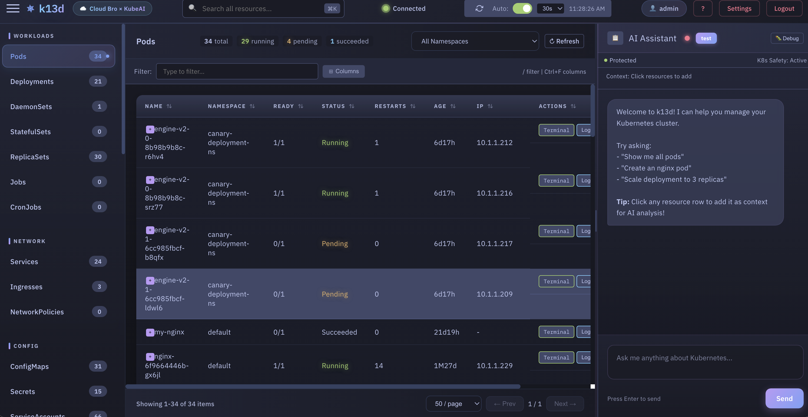
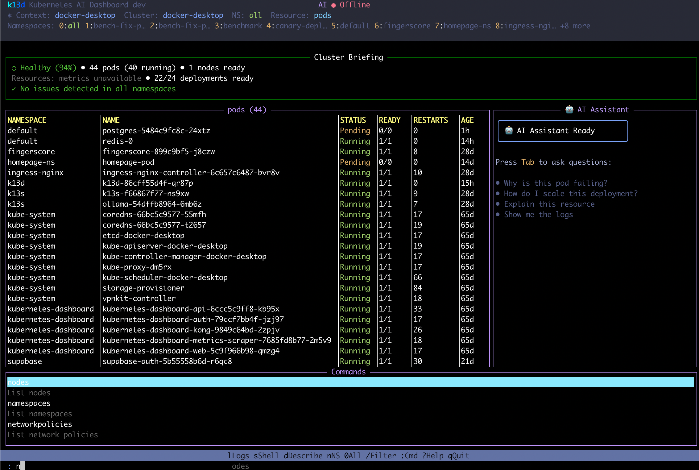

<h1 align="center">k13d</h1>

<p align="center">
  <strong>The all-in-one Kubernetes dashboard for terminal and browser, with AI built in.</strong>
</p>

<p align="center">
  <code><b>k</b>ubeaidashboar<b>d</b></code>  = <code><b>k</b></code>+ <code>13 letters</code> + <code><b>d</b></code> = <code><b>k13d</b></code>
</p>

<p align="center">
  One binary, one command.<br>
  Get a full Kubernetes dashboard in TUI or Web UI, plus an AI assistant that can actually take action.
</p>

<p align="center">
  <a href="https://github.com/cloudbro-kube-ai/k13d/releases"></a>
  
  
  
  
</p>

<p align="center">
  <a href="https://cloudbro-kube-ai.github.io/k13d/"><strong>Official Docs</strong></a> ·
  <a href="https://github.com/cloudbro-kube-ai/k13d/releases"><strong>Download</strong></a> ·
  <a href="docs-site/docs/user-guide/web.md"><strong>Web UI Guide</strong></a> ·
  <a href="docs-site/docs/user-guide/tui.md"><strong>TUI Guide</strong></a> ·
  <a href="docs-site/docs/ko/index.md"><strong>한국어</strong></a>
</p>

---

> [!WARNING]
> **Current support status**
> k13d currently supports and recommends **local single-binary usage** for the **TUI** and **Web UI**.
> **Docker, Docker Compose, Kubernetes, Helm, and other containerized/in-cluster deployment paths are still Beta / in preparation and are not officially supported yet.**
> There is also **no official public Docker image repository** for end users at this time, so the deployment docs should be treated as roadmap/reference material, not a supported install path.

## Web UI

<p align="center">
  
</p>

## TUI

<p align="center">
  
</p>

---

## Get Started in 30 Seconds

**1. Download** from [Releases](https://github.com/cloudbro-kube-ai/k13d/releases) — single binary, no dependencies.

```bash
tar xzf k13d_*.tar.gz && chmod +x k13d
```

> macOS: if blocked, run `xattr -d com.apple.quarantine ./k13d`

**2. Run.**

#### TUI mode — terminal dashboard with Vim navigation + AI panel

```bash
./k13d
```

Opens a full-featured terminal dashboard. Use `j/k` to navigate, `Enter` or `→` to open related resources, `Ctrl+E` to toggle the AI panel, `Alt+F` to temporarily expand the AI panel to full size, and `Enter` on a selected row while the AI panel is open to attach that row as AI context.

#### Web UI mode — browser dashboard (local / desktop)

```bash
./k13d --web --auth-mode local
# Open http://localhost:8080 — Username: admin / Password: printed in terminal
```

The Web UI is responsive on smaller screens and now renders Kubernetes lists with a stale-first dashboard flow, so recently viewed data appears immediately while fresh data is revalidated in the background.

**`--auth-mode local`** uses simple username/password authentication stored in memory — ideal for local development and desktop use. No Kubernetes tokens or external auth providers required. Just start and log in.

> If `--admin-user` and `--admin-password` are not specified, the username defaults to `admin` and a **secure random password is generated** and printed to the terminal on startup. You can also set credentials via environment variables: `K13D_USERNAME` and `K13D_PASSWORD`.

#### Both modes — Web UI + TUI simultaneously

```bash
./k13d --web --auth-mode local &   # Web UI in background
./k13d                            # TUI in foreground
```

Run the Web UI as a background process, then launch the TUI in the foreground. Both share the same kubeconfig.

#### Authentication Modes

| Mode | Flag | Status / Use Case |
|------|------|-------------------|
| **Local** | `--auth-mode local` | Supported. Recommended for local desktop Web UI use |
| **Token** | `--auth-mode token` | Preview only. Deployment-oriented path is not officially supported yet |
| **LDAP** | `--auth-mode ldap` | Preview only. Provider wiring is still incomplete |
| **OIDC** | `--auth-mode oidc` | Preview only. Provider wiring is still incomplete |
| **No Auth** | `--no-auth` | Development/testing only (not recommended) |

`--auth-mode ldap` and `--auth-mode oidc` select those login paths, but the current stock binary does not yet expose every provider-specific LDAP/OIDC field as dedicated CLI flags. The Web UI auth settings page currently shows runtime status rather than persisting provider config.

If you're evaluating k13d today, focus on:

- Local **TUI** with your existing kubeconfig
- Local **Web UI** via `./k13d --web --auth-mode local`
- Official docs at [cloudbro-kube-ai.github.io/k13d](https://cloudbro-kube-ai.github.io/k13d/)

#### Flags

| Flag | Description |
|------|-------------|
| `--web` | Start Web UI server (default port 8080) |
| `--tui` | Start TUI mode explicitly (default when `--web` is not specified) |
| `--mcp` | Start MCP server mode (stdio transport) |
| `--port <N>` | Custom port for Web UI |
| `--config <path>` | Use a non-default `config.yaml` path |
| `--auth-mode <mode>` | Auth mode: `local`, `token`, `ldap`, `oidc` |
| `--admin-user <name>` | Admin username for local auth (env: `K13D_USERNAME`) |
| `--admin-password <pw>` | Admin password for local auth (env: `K13D_PASSWORD`) |
| `--no-auth` | Disable auth (dev only) |
| `-n <namespace>` | Start in a specific namespace |
| `-A` | Start with all namespaces |
| `--version` | Show version information |
| `--completion <shell>` | Generate shell completion (bash, zsh, fish) |
| `--storage-info` | Show storage configuration and data locations |
| `--db-path <path>` | Custom SQLite database path |
| `--no-db` | Disable database persistence entirely |

That's it. Your kubeconfig is auto-detected.

#### Configuration

k13d stores `config.yaml` in the platform config directory by default and creates it on the first successful save from Web UI, TUI, or any internal `Save()` path.

| Platform | Default config path |
|----------|---------------------|
| Linux | `${XDG_CONFIG_HOME:-~/.config}/k13d/config.yaml` |
| macOS | `~/.config/k13d/config.yaml` |
| Windows | `%AppData%\\k13d\\config.yaml` |

For configuration details, model profiles, storage paths, and example `config.yaml` files, use the official docs:

- [Official Docs (GitHub Pages)](https://cloudbro-kube-ai.github.io/k13d/)
- [Installation Guide](docs-site/docs/getting-started/installation.md)
- [Configuration Guide](docs-site/docs/getting-started/configuration.md)
- [Web UI Guide](docs-site/docs/user-guide/web.md)
- [TUI Guide](docs-site/docs/user-guide/tui.md)
- [MCP Integration](docs-site/docs/concepts/mcp-integration.md)
- [한국어 가이드](docs-site/docs/ko/index.md)

---

## Why k13d?

|                          |  k13d   | k9s | Lens | kubectl |
| ------------------------ | :-----: | :-: | :--: | :-----: |
| Terminal UI              | **Yes** | Yes |  -   |    -    |
| Web UI                   | **Yes** |  -  | Yes  |    -    |
| AI Assistant             | **Yes** |  -  |  -   |    -    |
| Single binary, zero deps | **Yes** | Yes |  -   |   Yes   |
| Free & open source       | **Yes** | Yes | Paid |   Yes   |

### Web UI — Everything in the browser

- **Dashboard** — Pods, Deployments, Services, all resources with real-time status
- **AI Assistant** — Ask questions, AI executes kubectl with explicit approval by default
  The default agentic toolset is kubectl-first. `bash` and MCP tools are opt-in, and unsupported interactive kubectl flows are hard-blocked instead of sent to approval.
- **Topology** — Graph & tree visualization of resource relationships
- **Reports** — Cluster health, node checks, security audit, heuristic FinOps cost analysis
- **Metrics** — Historical CPU/Memory/Pods/Nodes charts (SQLite-backed, 7-day retention)
- **Helm** — Release management, history, rollback
- **Terminal** — Full xterm.js shell into any pod
- **Logs** — Real-time streaming with ANSI colors, search, download
- **Jobs & CronJobs** — Local-time next run, last run, and recent execution history
- **RBAC Viewer** — Subject-to-role relationship map with permission details
- **Network Policy Map** — Ingress/egress rule visualization
- **Event Timeline** — Cluster events grouped by time windows
- **Security Scanning** — Trivy CVE scanner with air-gapped support
- **Resource Templates** — One-click deploy (Nginx, Redis, PostgreSQL, etc.)
- **Notifications** — Slack, Discord, Teams, Email (SMTP) alerts for cluster events
- **Applications View** — App-centric grouping by Helm and K8s labels
- **Validate View** — Cross-resource validation with severity levels
- **5 Themes** — Tokyo Night (default), Production, Staging, Development, Light

### TUI — k9s on steroids

- **Vim navigation** — `j/k`, `g/G`, `/` filter, `:` commands
- **AI panel** — `Tab` to chat, AI executes commands for you
- **Node insights** — `:nodes` shows control-plane/worker role plus CPU, memory, and GPU usage bars
- **Sort** — `Shift+N` name, `Shift+A` age, `Shift+T` status, `:sort` picker
- **Autocomplete** — Dropdown suggestions as you type
- **Aliases** — Custom shortcuts (`pp` -> `pods`) via `aliases.yaml`
- **Plugins** — External tool integration via `plugins.yaml`
- **Hotkeys** — Custom keyboard shortcuts via `hotkeys.yaml`
- **Model switching** — `:model` to switch saved AI model profiles at runtime
- **i18n** — English, Korean, Chinese, Japanese

---

## AI Setup (Optional)

Configure in **Settings > AI** in the Web UI, or via environment:

```bash
# OpenAI
export K13D_LLM_PROVIDER=openai
export K13D_LLM_MODEL=gpt-4o
export K13D_LLM_API_KEY=sk-...
./k13d --web --auth-mode local

# Anthropic
export K13D_LLM_PROVIDER=anthropic
export K13D_LLM_MODEL=claude-sonnet-4-6
export K13D_LLM_ENDPOINT=https://api.anthropic.com
export K13D_LLM_API_KEY=sk-ant-...
./k13d --web --auth-mode local

# Ollama (local, free, no API key)
ollama pull gpt-oss:20b && ollama serve
./k13d --web --auth-mode local
# Set Provider: "ollama" in Settings > AI
```

For **Ollama**, choose a model that explicitly supports **tools/function calling**. Some Ollama models can connect and generate text, but k13d's AI Assistant will not work correctly unless the model supports tools. `gpt-oss:20b` is the recommended default.

Embedded LLM support has been removed. For local/private inference, use **Ollama** instead.

Model profiles, provider-specific examples, and config ownership are documented in:

- [Official Docs](https://cloudbro-kube-ai.github.io/k13d/)
- [Configuration Guide](docs-site/docs/getting-started/configuration.md)
- [Model Settings & Storage](docs-site/docs/ai-llm/model-settings-storage.md)

### Supported AI Providers

| Provider | Models | Notes |
|----------|--------|-------|
| **OpenAI** | GPT-4o, GPT-4, o3-mini | Best tool calling support |
| **Anthropic** | Claude Sonnet 4.6, Opus 4.6, Haiku 4.5 | Native Messages API, strong reasoning |
| **Google Gemini** | Gemini 2.5, 2.0 | Multimodal capable |
| **Upstage Solar** | Solar Pro2, Solar Pro | Good balance of quality/cost |
| **Azure OpenAI** | GPT-4, GPT-3.5 | Enterprise Azure deployments |
| **AWS Bedrock** | Claude, Llama, Mistral | AWS-hosted models |
| **Ollama** | GPT-OSS, Qwen, Llama, Mistral | Local, free, no API key, choose a tools-capable model |

The AI assistant can:

- Diagnose pod crashes and suggest fixes
- Execute kubectl commands with your approval
- Keep read-only `kubectl get` style actions behind `Decision Required` unless you explicitly enable auto-approve
- Prefer `kubectl` over `bash`; shell access is treated as a last resort
- Expose `bash` and MCP tools only when you explicitly enable them in `config.yaml`
- Hard-block unsupported interactive flows such as `kubectl edit`, `kubectl port-forward`, and `kubectl exec -it`
- Scale deployments, restart rollouts
- Analyze YAML, events, and logs in context
- Use MCP tools for extended capabilities

If you use `config.yaml`, the safest default is:

```yaml
llm:
  enable_bash_tool: false
  enable_mcp_tools: false
```

---

## MCP (Model Context Protocol)

k13d supports MCP for extending AI capabilities with external tools. Run k13d as an MCP client (connects to external MCP servers) or as an MCP server (exposes k13d tools to other AI systems).

```bash
# Run as MCP server (stdio transport)
./k13d --mcp
```

Configure MCP servers in your active `config.yaml`:

```yaml
mcp:
  servers:
    - name: kubernetes
      command: npx
      args: ["-y", "@anthropic/mcp-server-kubernetes"]
    - name: thinking
      command: npx
      args: ["-y", "@modelcontextprotocol/server-sequential-thinking"]
```

See the [MCP Guide](docs-site/docs/concepts/mcp-integration.md) for details.

---

## CLI Reference

```bash
./k13d                                    # TUI mode
./k13d --web --auth-mode local           # Web UI — local auth (desktop use)
./k13d --web --auth-mode token           # Web UI — token auth path (preview only)
./k13d --web --port 3000                 # Custom port
./k13d --web --no-auth                   # No auth (dev only)
./k13d --mcp                             # MCP server mode
./k13d -n kube-system                    # Start in specific namespace
./k13d -A                                # Start with all namespaces
./k13d --version                         # Show version
./k13d --completion bash                 # Generate shell completion
./k13d --storage-info                    # Show storage configuration
```

### Shell Completion

```bash
# Bash
source <(./k13d --completion bash)

# Zsh
source <(./k13d --completion zsh)

# Fish
./k13d --completion fish | source
```

---

## Deployment Status

Docker, Docker Compose, Kubernetes, and Helm packaging are still **Beta / in preparation**.

- No official public Docker image repository is available yet
- The deployment files in this repository are roadmap/reference material for upcoming work
- The supported experience today is the local **TUI** and local **Web UI**

---

## Build from Source

```bash
git clone https://github.com/cloudbro-kube-ai/k13d.git && cd k13d
make build
```

---

## Documentation

- Official docs site: [cloudbro-kube-ai.github.io/k13d](https://cloudbro-kube-ai.github.io/k13d/)
- Repository docs: [Installation](docs-site/docs/getting-started/installation.md), [Web UI](docs-site/docs/user-guide/web.md), [TUI](docs-site/docs/user-guide/tui.md), [Configuration](docs-site/docs/getting-started/configuration.md), [MCP](docs-site/docs/concepts/mcp-integration.md), [한국어](docs-site/docs/ko/index.md)

---

## License

MIT License - see [LICENSE](LICENSE).

<p align="center">
  <a href="https://github.com/cloudbro-kube-ai/k13d">
    
  </a>
</p>
