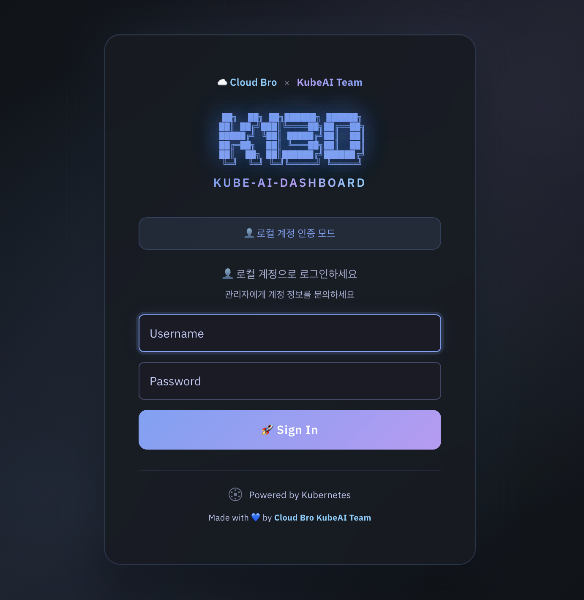
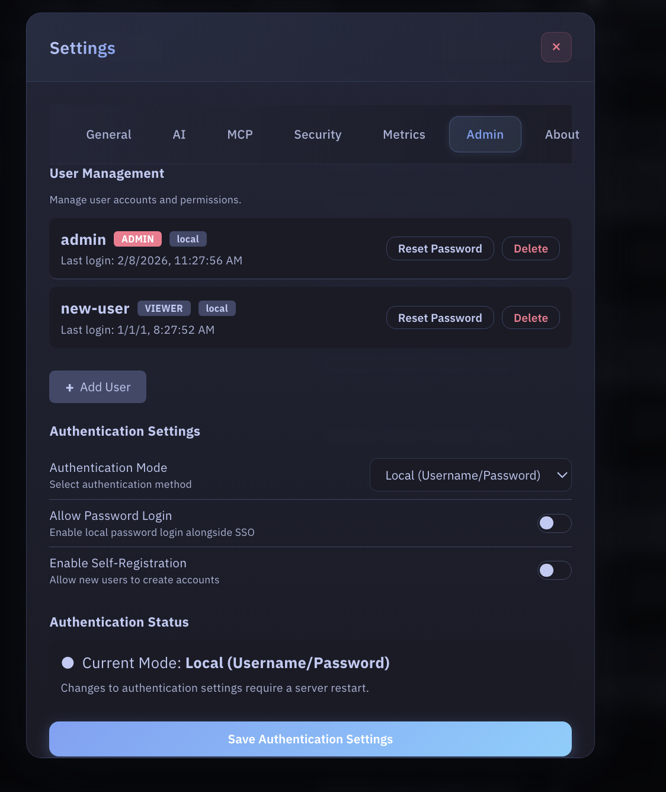
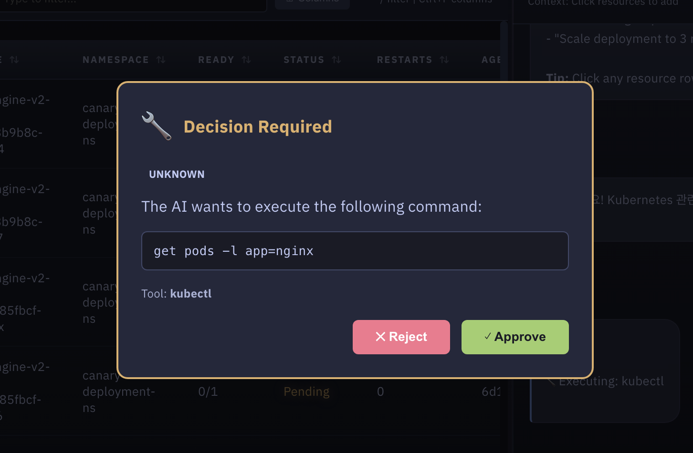

# Security Features

k13d combines authentication, RBAC, audit logging, and AI command safety controls.

---

## Overview

| Feature | Status | Notes |
|---------|--------|-------|
| Authentication | Implemented | Local, token, LDAP auth path, OIDC auth path |
| Authorization | Implemented | Deny-overrides-allow RBAC |
| Audit Logging | Implemented | SQLite and optional audit file |
| JWT Settings | Implemented | Configured under `authorization.jwt` |
| User Locking | Implemented | Admin lock/unlock flow |
| AI Tool Approval | Implemented | `authorization.tool_approval` in `config.yaml` |
| Native SAML | Not implemented | Use SAML-to-OIDC bridge or reverse proxy |
| Native MFA for local/LDAP | Not implemented | Enforce MFA in your IdP / proxy layer |

---

## What Lives Where

### `config.yaml`

`~/.config/k13d/config.yaml` is the source of truth for:

- LLM settings and saved model profiles
- MCP servers
- storage and audit persistence
- Prometheus settings
- RBAC and JWT settings under `authorization`
- AI tool approval policy under `authorization.tool_approval`

### Web authentication provider settings

The current build does **not** persist LDAP or OIDC provider configuration from the Web UI into `config.yaml`.

- The Web UI authentication section currently shows **runtime status** only.
- Changing auth provider settings still requires **startup-time configuration** and a **server restart**.
- Local and token auth are turnkey through CLI flags.
- LDAP and OIDC code paths exist in the auth layer, but the stock binary does not yet expose full first-class CLI flags for every provider field.

This distinction matters:

- `authorization` in `config.yaml` controls RBAC, JWT, access requests, impersonation, and tool approval.
- `auth mode` controls how users log in to the Web UI.

---

## Authentication Modes

### Login Page



| Mode | Current usability | How it works |
|------|-------------------|--------------|
| `local` | Ready | In-memory username/password users |
| `token` | Ready | Kubernetes TokenReview-based login |
| `ldap` | Auth layer exists | Requires LDAP provider config at startup |
| `oidc` | Auth layer exists | Requires OIDC provider config at startup |
| `--no-auth` | Ready | Development/testing only |

### Local Authentication

Use local auth for desktop use or small standalone deployments:

```bash
k13d --web --auth-mode local
k13d --web --auth-mode local --admin-user admin --admin-password changeme
```

Notes:

- If `--admin-password` is omitted, k13d generates a random password and prints it on startup.
- Local users are managed from the Web UI admin panel.

### Token Authentication

Use token auth when users should log in with Kubernetes credentials:

```bash
k13d --web --auth-mode token
```

This is the default auth mode for the stock binary.

---

## LDAP Integration

The LDAP implementation lives in `pkg/web/auth_ldap.go` and expects three things:

1. A reachable LDAP or LDAPS endpoint.
2. A service account bind, if anonymous search is not allowed.
3. A directory layout that lets k13d:
   - find the user entry
   - bind as that user to validate the password
   - optionally search groups to determine the k13d role

### Runtime Flow

1. Connect to `ldap://host:port` or `ldaps://host:port`
2. Optionally start TLS if `start_tls` is enabled
3. Bind with `bind_dn` and `bind_password`
4. Search for the user with `user_search_filter`
5. Bind as the found user DN with the supplied password
6. Re-bind as the service account if group lookup is needed
7. Search groups with `group_search_filter`
8. Map groups to `admin`, `user`, or `viewer`

### LDAP Fields Expected by the Auth Layer

The auth layer expects a structure equivalent to this:

```yaml
auth:
  mode: ldap
  session_duration: 24h

ldap:
  enabled: true
  host: ldap.example.com
  port: 636
  use_tls: true
  start_tls: false
  insecure_skip_tls: false

  bind_dn: cn=k13d-bind,ou=svc,dc=example,dc=com
  bind_password: ${LDAP_BIND_PASSWORD}

  base_dn: dc=example,dc=com
  user_search_base: ou=people,dc=example,dc=com
  user_search_filter: (uid=%s)

  group_search_base: ou=groups,dc=example,dc=com
  group_search_filter: (member=%s)

  username_attr: uid
  email_attr: mail
  display_name_attr: cn

  admin_groups: ["k13d-admins"]
  user_groups: ["k13d-users"]
  viewer_groups: ["k13d-viewers"]
```

Important implementation details from code:

- `%s` in `user_search_filter` is replaced with the escaped username.
- `%s` in `group_search_filter` is replaced with the escaped user DN.
- Group names are read from the group's `cn` attribute.
- Group matching is case-insensitive.
- Role priority is:
  1. `admin_groups`
  2. `user_groups`
  3. `viewer_groups`
  4. default to `viewer`

### Directory Shape: OpenLDAP Example

```text
dc=example,dc=com
├── ou=people
│   ├── uid=alice
│   └── uid=bob
└── ou=groups
    ├── cn=k13d-admins
    ├── cn=k13d-users
    └── cn=k13d-viewers
```

Recommended config:

```yaml
ldap:
  enabled: true
  host: ldap.example.com
  port: 636
  use_tls: true
  bind_dn: cn=k13d-bind,ou=svc,dc=example,dc=com
  bind_password: ${LDAP_BIND_PASSWORD}
  base_dn: dc=example,dc=com
  user_search_base: ou=people,dc=example,dc=com
  user_search_filter: (uid=%s)
  group_search_base: ou=groups,dc=example,dc=com
  group_search_filter: (member=%s)
  username_attr: uid
  email_attr: mail
  display_name_attr: cn
  admin_groups: ["k13d-admins"]
  user_groups: ["k13d-users"]
  viewer_groups: ["k13d-viewers"]
```

### Directory Shape: Active Directory Example

```text
DC=corp,DC=example,DC=com
├── OU=Users
│   ├── CN=Alice Kim
│   └── CN=Bob Lee
└── OU=Groups
    ├── CN=K13D-Admins
    ├── CN=K13D-Users
    └── CN=K13D-Viewers
```

Recommended config:

```yaml
ldap:
  enabled: true
  host: dc1.corp.example.com
  port: 636
  use_tls: true
  bind_dn: CN=k13d-bind,OU=Service Accounts,DC=corp,DC=example,DC=com
  bind_password: ${LDAP_BIND_PASSWORD}
  base_dn: DC=corp,DC=example,DC=com
  user_search_base: OU=Users,DC=corp,DC=example,DC=com
  user_search_filter: (sAMAccountName=%s)
  group_search_base: OU=Groups,DC=corp,DC=example,DC=com
  group_search_filter: (member=%s)
  username_attr: sAMAccountName
  email_attr: mail
  display_name_attr: displayName
  admin_groups: ["K13D-Admins"]
  user_groups: ["K13D-Users"]
  viewer_groups: ["K13D-Viewers"]
```

### TLS Guidance

Choose one of these:

- `use_tls: true` with port `636` for LDAPS
- `start_tls: true` with port `389` for StartTLS

Avoid `insecure_skip_tls: true` outside lab environments.

### LDAP Validation Checklist

Before blaming k13d, verify:

1. The bind account can search the configured `user_search_base`
2. The user filter returns exactly one entry
3. The user DN can bind with the entered password
4. Group lookup returns group `cn` values that match your configured role lists
5. TLS certificates are trusted by the host running k13d

---

## OIDC / SSO

The OIDC implementation lives in `pkg/web/auth_oidc.go`.

### Runtime Flow

1. Fetch the OpenID discovery document from `provider_url`
2. Redirect the user to the provider authorization endpoint
3. Validate the returned `state`
4. Exchange the authorization code for tokens
5. Call the provider `userinfo` endpoint
6. Determine the k13d role from `groups`, `roles`, or `group_mappings`
7. Create a k13d session cookie

### OIDC Fields Expected by the Auth Layer

```yaml
auth:
  mode: oidc
  session_duration: 24h

oidc:
  provider_name: Okta
  provider_url: https://example.okta.com/oauth2/default
  client_id: ${OIDC_CLIENT_ID}
  client_secret: ${OIDC_CLIENT_SECRET}
  redirect_uri: https://k13d.example.com/api/auth/oidc/callback
  scopes: openid email profile groups

  roles_claim: roles
  admin_roles: ["k13d-admin", "platform-admin"]
  user_roles: ["k13d-user"]
  default_role: viewer
  group_mappings:
    k13d-viewers: viewer
    k13d-developers: user
```

Current code behavior:

- Discovery is automatic through `/.well-known/openid-configuration`
- If `redirect_uri` is empty, k13d derives it from the incoming request
- The role mapper checks `userinfo.groups` first, then `userinfo.roles`
- `group_mappings` is matched by exact key
- `default_role` falls back to `viewer`
- The current implementation does not expose SAML directly

### OIDC Role Mapping Notes

If your provider does not emit `groups` or `roles` in the `userinfo` response, k13d will not infer richer roles by itself. In that case:

- add the claims in the IdP
- use `group_mappings`
- or rely on `default_role`

### Local HTTP vs HTTPS

OIDC session cookies must only be `Secure` on HTTPS requests. The current code now sets the cookie security flag based on the actual request scheme, which avoids broken OIDC login on local `http://localhost` development setups.

---

## MFA / 2FA Guidance

k13d does **not** implement its own second factor for local auth or raw LDAP auth.

If you want two-factor authentication:

- prefer `oidc` mode
- enforce MFA in your IdP such as Okta, Keycloak, Google, Azure AD, or Authentik
- let k13d trust the IdP after the OIDC login completes

This is the cleanest design because:

- password policy, MFA, device trust, and recovery stay in one system
- k13d only needs user identity and role/group claims
- Web UI and API share the same upstream identity decision

### LDAP + MFA

If your organization authenticates users against LDAP but requires MFA, do **not** bolt MFA into k13d directly. Instead:

1. Put an IdP or access proxy in front of LDAP
2. Have that layer authenticate against LDAP/AD
3. Enforce MFA there
4. Expose OIDC to k13d
5. Run k13d in `oidc` mode

That gives you LDAP-backed identities with modern MFA.

---

## SAML

Native SAML support is not implemented in k13d today.

If your organization standardizes on SAML, use one of these patterns:

- Keycloak, Authentik, Okta, Azure AD, or another IdP that can accept SAML upstream and expose OIDC downstream
- `oauth2-proxy` or a similar reverse proxy in front of k13d
- an ingress / auth gateway that performs SAML and forwards authenticated traffic to k13d

Recommended architecture:

```text
User -> SAML IdP -> OIDC bridge / auth proxy -> k13d (--auth-mode oidc)
```

That is the practical way to get SAML + MFA + centralized policy while keeping k13d on one supported protocol surface.

---

## Web UI Authentication Settings

### Authentication Control



Current behavior in the Web UI:

- local user management works
- password reset works for local users
- current auth mode and runtime provider status are visible
- provider-specific LDAP/OIDC fields are shown as runtime information
- provider changes still require startup config changes and restart

The Web UI no longer pretends these provider settings are persisted when they are not.

---

## RBAC Authorization

k13d uses a Teleport-inspired deny-overrides-allow RBAC system.

### Role System

| Role | Permissions |
|------|-------------|
| **Viewer** | Read-only access to resources |
| **User** | View plus approved operational actions |
| **Admin** | Full access including destructive actions |

### Permission Matrix

| Action | Viewer | User | Admin |
|--------|:------:|:----:|:-----:|
| View resources | ✅ | ✅ | ✅ |
| View logs | ✅ | ✅ | ✅ |
| Execute read commands | ❌ | ✅ | ✅ |
| Execute write commands | ❌ | ⚠️ | ✅ |
| Delete resources | ❌ | ❌ | ✅ |
| Manage users | ❌ | ❌ | ✅ |
| View audit logs | ❌ | ❌ | ✅ |

### Config Example

```yaml
authorization:
  default_tui_role: viewer
  roles:
    - name: production-viewer
      allow:
        - resources: ["pods", "services", "deployments"]
          actions: ["view", "logs"]
          namespaces: ["production"]
```

### Impersonation

```yaml
authorization:
  impersonation:
    enabled: true
    mappings:
      viewer:
        user: k13d-viewer-sa
        groups: ["viewers"]
      admin:
        user: k13d-admin-sa
        groups: ["admins"]
```

---

## Audit Logging

All important actions are written to SQLite when persistence is enabled.

### Common Event Types

| Event | Meaning |
|-------|---------|
| `login` | User authentication |
| `logout` | User logout |
| `update_settings` | Settings change |
| `update_llm_settings` | LLM configuration change |
| `approve` | Tool approval |
| `reject` | Tool rejection |
| `execute` | Command execution |
| `lock` | User account lock |

### API

```bash
curl http://localhost:8080/api/audit
curl http://localhost:8080/api/audit?action=execute
curl http://localhost:8080/api/audit?user=admin
```

---

## AI Tool Approval



AI-generated commands are classified before execution.

| Category | Examples | Default behavior |
|----------|----------|------------------|
| Read-only | `get`, `describe`, `logs` | Auto-approve |
| Write | `apply`, `create`, `patch`, `scale` | Approval required |
| Dangerous | `delete`, `drain`, destructive shell patterns | Approval required or blocked |
| Unknown | Non-recognized tool commands | Approval required |

### `config.yaml`

```yaml
authorization:
  tool_approval:
    auto_approve_read_only: true
    require_approval_for_write: true
    require_approval_for_unknown: true
    block_dangerous: false
    blocked_patterns:
      - "rm -rf /"
      - "kubectl delete ns kube-system"
    approval_timeout_seconds: 60
```

The Web UI setting for skipping `Decision Required` now maps to the same backend policy used by tool execution.

---

## Best Practices

1. Use `--auth-mode local` for local desktop use and `--auth-mode token` for in-cluster deployments.
2. If you need MFA, prefer OIDC and enforce MFA in the IdP.
3. Treat LDAP as a directory integration, not as the MFA boundary.
4. Keep `authorization.tool_approval.block_dangerous` enabled in sensitive clusters.
5. Set `authorization.default_tui_role` to the lowest role that makes sense.
6. Review audit logs regularly.
