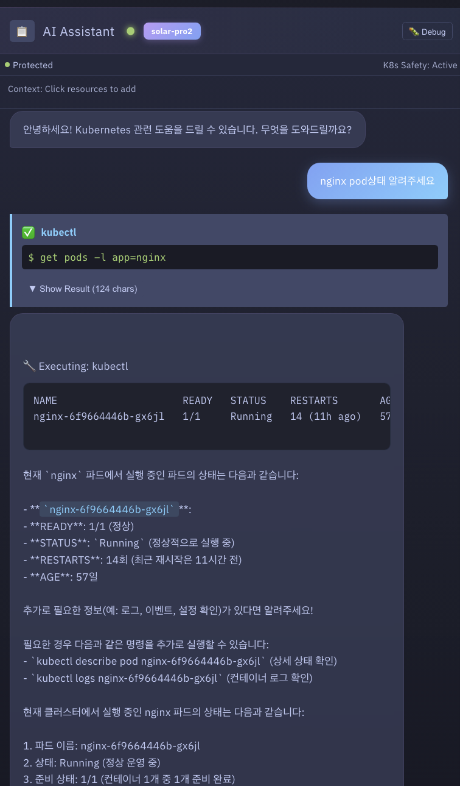
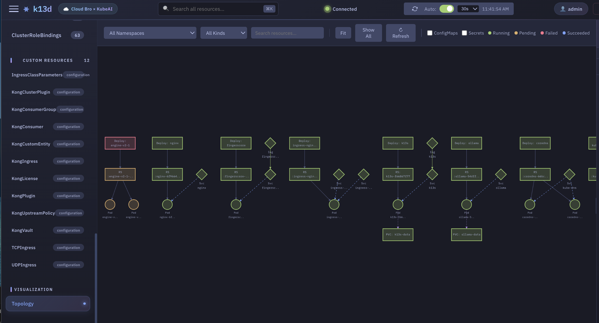
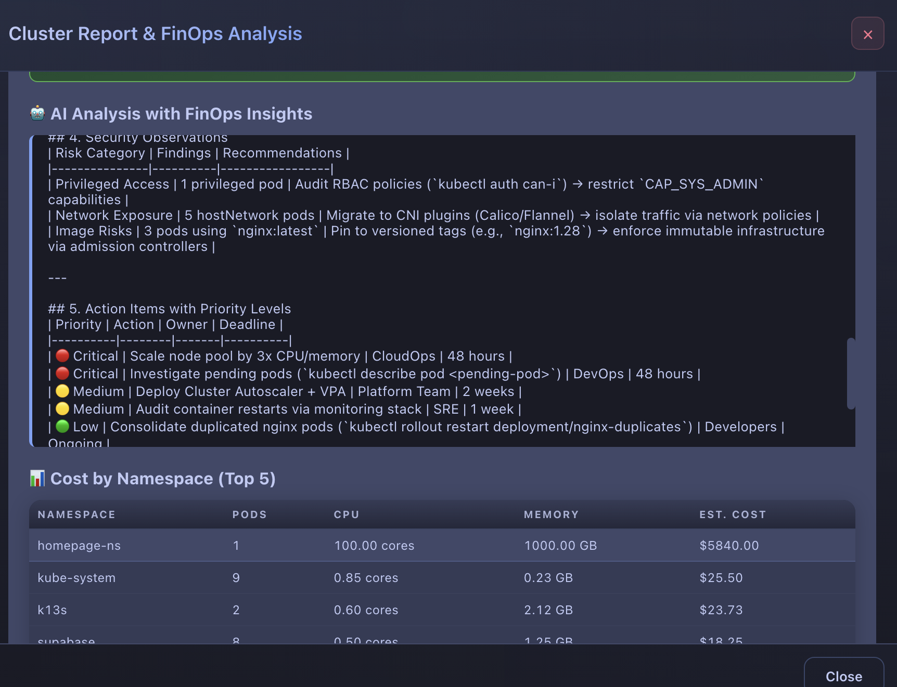
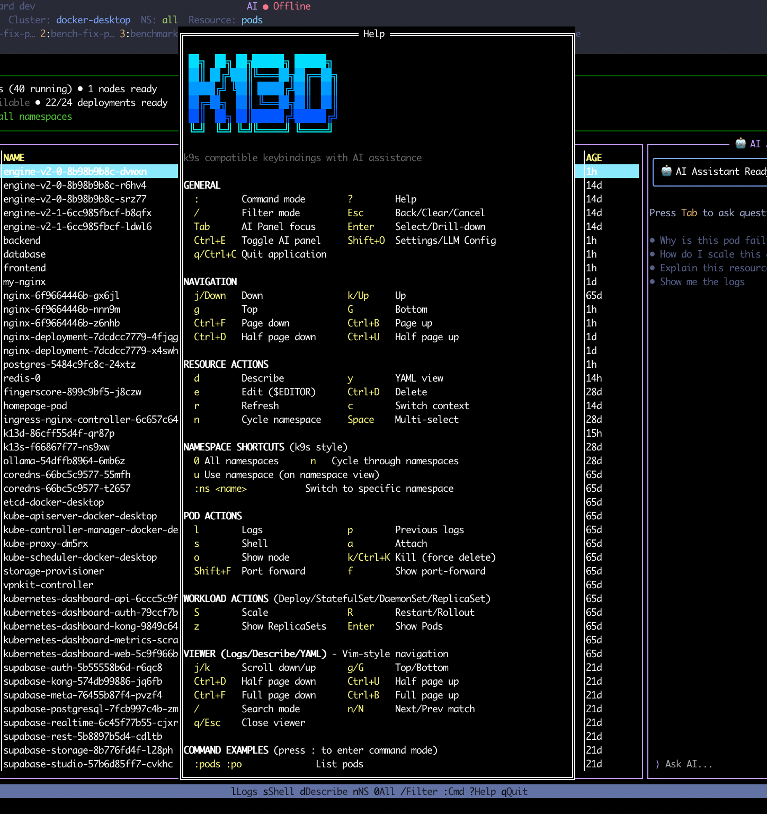

# k13d 한국어 가이드

k13d는 Kubernetes 클러스터를 관리하기 위한 올인원 대시보드입니다.
Terminal UI(TUI)와 Web UI를 모두 제공하며, AI Assistant가 내장되어 있습니다.

---

## 30초 만에 시작하기

실습은 **Release Asset 다운로드 → 압축 해제 → 실행** 만 하면 됩니다.

### 1. 먼저 확인

```bash
kubectl get nodes
```

### 2. 운영체제에 맞는 자산 다운로드

[Releases](https://github.com/cloudbro-kube-ai/k13d/releases/tag/v1.0.0) 페이지의 **Assets** 에서 내 OS / CPU 에 맞는 파일을 선택하세요.

- macOS Apple Silicon: `k13d_v1.0.0_darwin_arm64.tar.gz`
- macOS Intel: `k13d_v1.0.0_darwin_amd64.tar.gz`
- Linux x86_64: `k13d_v1.0.0_linux_amd64.tar.gz`
- Linux arm64: `k13d_v1.0.0_linux_arm64.tar.gz`
- Windows x86_64: `k13d_v1.0.0_windows_amd64.zip`

### 3. 자세한 명령은 빠른 시작 문서에서 그대로 복사

- [빠른 시작](getting-started/quick-start.md)

!!! tip "macOS 사용자"
    압축 해제 후에는 아래 두 줄을 꼭 실행하세요.

    ```bash
    xattr -d com.apple.quarantine ./k13d
    xattr -d com.apple.provenance ./k13d
    ```

Web UI 권장 실행 명령은 `./k13d --web --port 9090 --auth-mode local` 이고,
브라우저에서 `http://localhost:9090` 으로 접속하면 됩니다.

TUI 기본 실행 명령은 `./k13d` 입니다.

---

## Web UI 주요 기능

Web UI는 브라우저에서 Kubernetes 클러스터의 모든 것을 관리할 수 있는 대시보드입니다.


### Dashboard & Resource 관리

| 기능 | 설명 |
|------|------|
| **Resource Table** | Pods, Deployments, Services 등 모든 리소스를 실시간으로 확인 |
| **Namespace / Context 전환** | 상단 바에서 namespace와 cluster context를 빠르게 전환 |
| **Detail Modal** | 리소스 클릭 시 Overview / YAML / Events 탭으로 상세 정보 확인 |
| **Custom Resource** | CRD 리소스도 동일한 상세 화면 (status badge, conditions, spec 자동 분석) |

### AI Assistant



AI Assistant는 자연어로 질문하면 kubectl 명령을 직접 실행해주는 agentic AI입니다. 기본적으로 `kubectl get` 같은 읽기 전용 작업도 실행 전에 승인 모달을 거치며, `bash`는 꼭 필요한 경우에만 마지막 수단으로 사용합니다.

```
사용자: "nginx pod이 왜 crash 하나요?"
AI: Pod의 YAML, Events, Logs를 분석하여 원인을 진단하고 해결 방법을 제시합니다.
```

- 읽기 전용/쓰기 명령 모두 기본적으로 실행 전 **승인(Approve/Reject)** 을 요청합니다
- OpenAI, Ollama, Anthropic, Gemini 등 다양한 LLM provider를 지원합니다
- Settings > AI에서 provider와 model을 설정할 수 있습니다

### Topology & Visualization



| 기능 | 설명 |
|------|------|
| **Topology Graph** | Deployment → ReplicaSet → Pod 관계를 interactive 그래프로 시각화 |
| **Topology Tree** | 리소스 소유 관계를 트리 형태로 표시 |
| **RBAC Viewer** | Subject → Role binding 관계를 시각적으로 확인 |
| **Network Policy Map** | Ingress/Egress 네트워크 정책을 시각화 |
| **Event Timeline** | 클러스터 이벤트를 시간대별로 그룹화하여 표시 |

### Reports & Metrics



| 기능 | 설명 |
|------|------|
| **Cluster Report** | 노드 상태, 워크로드, 보안, FinOps 비용 분석 등 선택적 섹션 구성 |
| **Metrics Charts** | CPU, Memory, Pod/Node 수를 시계열 차트로 표시 (SQLite 저장) |
| **Collect Now** | 즉시 메트릭 수집 트리거 |

### 기타 기능

- **Helm Manager** — Release 관리, history 확인, rollback
- **Pod Terminal** — xterm.js 기반 브라우저 터미널로 Pod에 접속
- **Log Viewer** — 실시간 로그 스트리밍, ANSI 컬러, 검색, 다운로드
- **Port Forward** — 컨테이너 포트를 로컬로 포워딩
- **Resource Templates** — Nginx, Redis, PostgreSQL 등 원클릭 배포
- **Notifications** — Slack, Discord, Teams, Email 알림
- **5가지 Theme** — Tokyo Night, Production, Staging, Development, Light

---

## TUI 주요 기능

TUI는 k9s 스타일의 터미널 대시보드로, Vim 키바인딩을 지원합니다.



### Navigation

| 키 | 동작 | 키 | 동작 |
|---|---|---|---|
| `j` / `k` | 위/아래 이동 | `g` / `G` | 맨 위/맨 아래 |
| `/` | Filter 모드 | `Esc` | 뒤로 가기 |
| `:` | Command 모드 | `?` | Help 보기 |
| `Tab` | AI Panel 포커스 | `q` | 종료 |

### Resource Actions

| 키 | 동작 | 키 | 동작 |
|---|---|---|---|
| `d` | Describe | `y` | YAML 보기 |
| `l` | Logs | `s` | Shell 접속 |
| `S` | Scale | `R` | Restart |
| `Ctrl+D` | Delete | `e` | Edit |

### Sorting

리소스를 이름, 상태, 최신 순 등 다양한 기준으로 정렬할 수 있습니다.

| 키 | 동작 |
|---|---|
| `Shift+N` | NAME 순 정렬 |
| `Shift+T` | STATUS 순 정렬 |
| `Shift+A` | AGE 순 정렬 (최신/오래된 순) |
| `:sort` | Column 선택 모달 |

같은 키를 다시 누르면 정렬 방향이 토글됩니다 (ascending ↔ descending).

### Autocomplete


`:` command 모드에서 타이핑하면 자동완성 드롭다운이 표시됩니다.
`aliases.yaml`에 정의한 커스텀 alias도 자동완성에 포함됩니다.

### AI Assistant

`Tab` 키로 AI Panel에 포커스를 맞추고 자연어로 질문하면 됩니다.

```
"kube-system namespace에서 running 중인 pod 목록 보여줘"
"이 deployment를 3개로 scale 해줘"
"왜 이 pod이 CrashLoopBackOff 인지 분석해줘"
```

---

## AI 설정 (Optional)

Web UI 실행 후 **Settings > AI** 에서 LLM provider를 설정하세요.

```bash
# OpenAI 사용
export OPENAI_API_KEY=sk-...
./k13d --web --auth-mode local

# Ollama 사용 (로컬, 무료)
ollama pull gpt-oss:20b && ollama serve
./k13d --web --auth-mode local
# Settings > AI에서 Provider를 "ollama"로 변경
```

중요: Ollama는 **tools/function calling** 을 지원하는 모델이어야 k13d AI Assistant가 정상 동작합니다. 텍스트만 생성하는 모델은 연결은 되어도 agentic 기능이 제대로 동작하지 않을 수 있습니다.

Web UI와 TUI에서 모델을 어떻게 저장하고, `config.yaml` 에 어떤 식으로 반영되는지 자세히 보려면 [모델 설정 및 저장](ai-llm/model-settings-storage.md) 문서를 참고하세요.

지원하는 LLM providers:

| Provider | 특징 |
|----------|------|
| **OpenAI** | GPT-4, GPT-4o 등 |
| **Ollama** | 로컬 실행, API key 불필요 |
| **Anthropic** | Claude 시리즈 |
| **Gemini** | Google AI |
| **Upstage/Solar** | Solar 모델 |

---

## CLI 옵션

```bash
./k13d                              # TUI 모드
./k13d --web                        # Web UI (port 8080)
./k13d --web --port 3000            # 커스텀 포트
./k13d --web --auth-mode local      # 로컬 인증 모드
./k13d --web --no-auth              # 인증 없음 (개발용)
./k13d --mcp                        # MCP 서버 모드
./k13d --storage-info               # 저장소 경로 확인
```

---

## 배포 상태 안내

현재 공식 지원 경로는 **로컬 바이너리 기반 TUI / Web UI** 입니다.

- Docker
- Docker Compose
- Kubernetes
- Helm

위 배포 방식은 아직 **Beta / 준비중** 이며, 공식 퍼블릭 Docker 저장소도 아직 제공되지 않습니다.

---

## 설정 파일

기본 설정 디렉터리는 운영체제에 따라 다음과 같습니다.

- Linux: `${XDG_CONFIG_HOME:-~/.config}/k13d/`
- macOS: `~/.config/k13d/`
- Windows: `%AppData%\\k13d\\`

예시 파일 구성:

```text
k13d/
├── config.yaml       # LLM, language, model profiles 설정
├── hotkeys.yaml      # 커스텀 단축키
├── plugins.yaml      # 외부 플러그인
├── aliases.yaml      # 리소스 command alias (예: pp → pods)
└── views.yaml        # 리소스별 기본 정렬 설정
```

실제로 어떤 파일을 읽고 있는지는 Web UI 시작 로그의 `Config File`, `Config Path Source`, `Env Overrides` 항목으로 바로 확인할 수 있습니다.

---

## 더 알아보기

전체 문서: **[https://cloudbro-kube-ai.github.io/k13d](https://cloudbro-kube-ai.github.io/k13d)**

| 주제 | 링크 |
|------|------|
| Web UI 기능 상세 | [Web UI Features](features/web-ui.md) |
| TUI 기능 상세 | [TUI Features](features/tui.md) |
| AI Assistant | [AI Guide](features/ai-assistant.md) |
| Configuration | [Config Guide](getting-started/configuration.md) |
| Docker 배포 | [Docker Guide](deployment/docker.md) |
| Kubernetes 배포 | [K8s Guide](deployment/kubernetes.md) |
