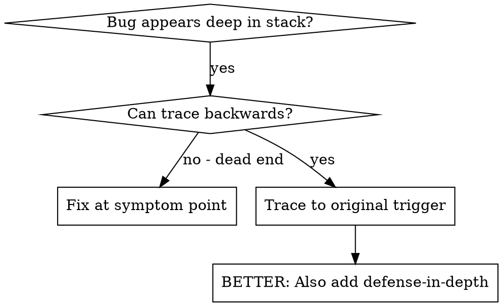
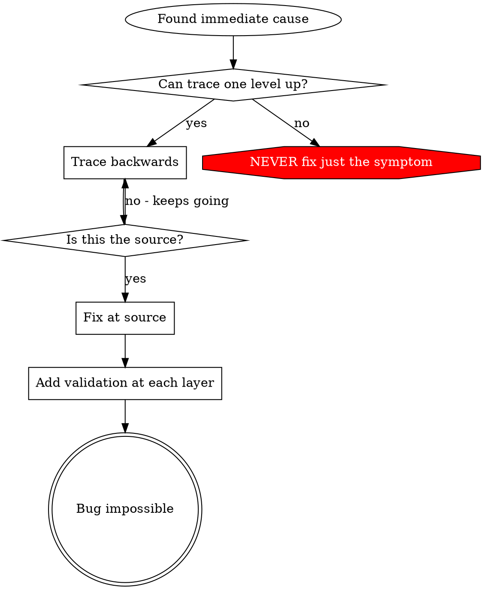
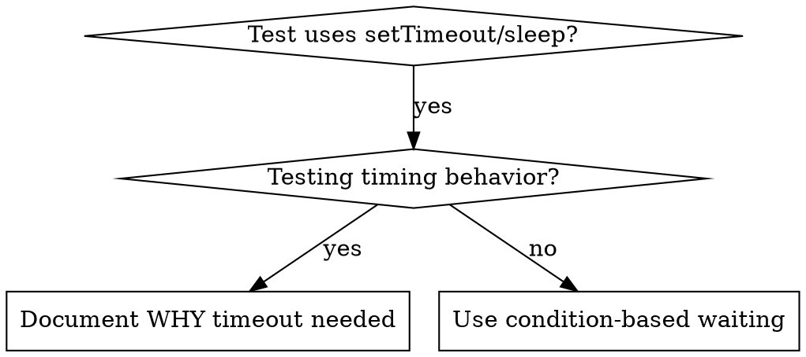

# Systematic Debugging

## Overview

Random fixes waste time and create new bugs. Quick patches mask underlying issues.

**Core principle:** ALWAYS find root cause before attempting fixes. Symptom fixes are failure.

**Violating the letter of this process is violating the spirit of debugging.**

## The Iron Law

```
NO FIXES WITHOUT ROOT CAUSE INVESTIGATION FIRST
```

If you haven't completed Phase 1, you cannot propose fixes.

## When to Use

Use for ANY technical issue:
- Test failures
- Bugs in production
- Unexpected behavior
- Performance problems
- Build failures
- Integration issues

**Use this ESPECIALLY when:**
- Under time pressure (emergencies make guessing tempting)
- "Just one quick fix" seems obvious
- You've already tried multiple fixes
- Previous fix didn't work
- You don't fully understand the issue

**Don't skip when:**
- Issue seems simple (simple bugs have root causes too)
- You're in a hurry (rushing guarantees rework)
- Manager wants it fixed NOW (systematic is faster than thrashing)

## The Four Phases

You MUST complete each phase before proceeding to the next.

### Phase 1: Root Cause Investigation

**BEFORE attempting ANY fix:**

1. **Read Error Messages Carefully**
   - Don't skip past errors or warnings
   - They often contain the exact solution
   - Read stack traces completely
   - Note line numbers, file paths, error codes

2. **Reproduce Consistently**
   - Can you trigger it reliably?
   - What are the exact steps?
   - Does it happen every time?
   - If not reproducible → gather more data, don't guess

3. **Check Recent Changes**
   - What changed that could cause this?
   - Git diff, recent commits
   - New dependencies, config changes
   - Environmental differences

4. **Gather Evidence in Multi-Component Systems**

   **WHEN system has multiple components (CI → build → signing, API → service → database):**

   **BEFORE proposing fixes, add diagnostic instrumentation:**
   ```
   For EACH component boundary:
     - Log what data enters component
     - Log what data exits component
     - Verify environment/config propagation
     - Check state at each layer

   Run once to gather evidence showing WHERE it breaks
   THEN analyze evidence to identify failing component
   THEN investigate that specific component
   ```

   **Example (multi-layer system):**
   ```bash
   # Layer 1: Workflow
   echo "=== Secrets available in workflow: ==="
   echo "IDENTITY: ${IDENTITY:+SET}${IDENTITY:-UNSET}"

   # Layer 2: Build script
   echo "=== Env vars in build script: ==="
   env | grep IDENTITY || echo "IDENTITY not in environment"

   # Layer 3: Signing script
   echo "=== Keychain state: ==="
   security list-keychains
   security find-identity -v

   # Layer 4: Actual signing
   codesign --sign "$IDENTITY" --verbose=4 "$APP"
   ```

   **This reveals:** Which layer fails (secrets → workflow ✓, workflow → build ✗)

5. **Trace Data Flow**

   **WHEN error is deep in call stack:**

   See `root-cause-tracing.md` in this directory for the complete backward tracing technique.

   **Quick version:**
   - Where does bad value originate?
   - What called this with bad value?
   - Keep tracing up until you find the source
   - Fix at source, not at symptom

### Phase 2: Pattern Analysis

**Find the pattern before fixing:**

1. **Find Working Examples**
   - Locate similar working code in same codebase
   - What works that's similar to what's broken?

2. **Compare Against References**
   - If implementing pattern, read reference implementation COMPLETELY
   - Don't skim - read every line
   - Understand the pattern fully before applying

3. **Identify Differences**
   - What's different between working and broken?
   - List every difference, however small
   - Don't assume "that can't matter"

4. **Understand Dependencies**
   - What other components does this need?
   - What settings, config, environment?
   - What assumptions does it make?

### Phase 3: Hypothesis and Testing

**Scientific method:**

1. **Form Single Hypothesis**
   - State clearly: "I think X is the root cause because Y"
   - Write it down
   - Be specific, not vague

2. **Test Minimally**
   - Make the SMALLEST possible change to test hypothesis
   - One variable at a time
   - Don't fix multiple things at once

3. **Verify Before Continuing**
   - Did it work? Yes → Phase 4
   - Didn't work? Form NEW hypothesis
   - DON'T add more fixes on top

4. **When You Don't Know**
   - Say "I don't understand X"
   - Don't pretend to know
   - Ask for help
   - Research more

### Phase 4: Implementation

**Fix the root cause, not the symptom:**

1. **Create Failing Test Case**
   - Simplest possible reproduction
   - Automated test if possible
   - One-off test script if no framework
   - MUST have before fixing
   - Use the `superpowers:test-driven-development` skill for writing proper failing tests

2. **Implement Single Fix**
   - Address the root cause identified
   - ONE change at a time
   - No "while I'm here" improvements
   - No bundled refactoring

3. **Verify Fix**
   - Test passes now?
   - No other tests broken?
   - Issue actually resolved?

4. **If Fix Doesn't Work**
   - STOP
   - Count: How many fixes have you tried?
   - If < 3: Return to Phase 1, re-analyze with new information
   - **If ≥ 3: STOP and question the architecture (step 5 below)**
   - DON'T attempt Fix #4 without architectural discussion

5. **If 3+ Fixes Failed: Question Architecture**

   **Pattern indicating architectural problem:**
   - Each fix reveals new shared state/coupling/problem in different place
   - Fixes require "massive refactoring" to implement
   - Each fix creates new symptoms elsewhere

   **STOP and question fundamentals:**
   - Is this pattern fundamentally sound?
   - Are we "sticking with it through sheer inertia"?
   - Should we refactor architecture vs. continue fixing symptoms?

   **Discuss with your human partner before attempting more fixes**

   This is NOT a failed hypothesis - this is a wrong architecture.

## Red Flags - STOP and Follow Process

If you catch yourself thinking:
- "Quick fix for now, investigate later"
- "Just try changing X and see if it works"
- "Add multiple changes, run tests"
- "Skip the test, I'll manually verify"
- "It's probably X, let me fix that"
- "I don't fully understand but this might work"
- "Pattern says X but I'll adapt it differently"
- "Here are the main problems: [lists fixes without investigation]"
- Proposing solutions before tracing data flow
- **"One more fix attempt" (when already tried 2+)**
- **Each fix reveals new problem in different place**

**ALL of these mean: STOP. Return to Phase 1.**

**If 3+ fixes failed:** Question the architecture (see Phase 4.5)

## your human partner's Signals You're Doing It Wrong

**Watch for these redirections:**
- "Is that not happening?" - You assumed without verifying
- "Will it show us...?" - You should have added evidence gathering
- "Stop guessing" - You're proposing fixes without understanding
- "Ultrathink this" - Question fundamentals, not just symptoms
- "We're stuck?" (frustrated) - Your approach isn't working

**When you see these:** STOP. Return to Phase 1.

## Common Rationalizations

| Excuse | Reality |
|--------|---------|
| "Issue is simple, don't need process" | Simple issues have root causes too. Process is fast for simple bugs. |
| "Emergency, no time for process" | Systematic debugging is FASTER than guess-and-check thrashing. |
| "Just try this first, then investigate" | First fix sets the pattern. Do it right from the start. |
| "I'll write test after confirming fix works" | Untested fixes don't stick. Test first proves it. |
| "Multiple fixes at once saves time" | Can't isolate what worked. Causes new bugs. |
| "Reference too long, I'll adapt the pattern" | Partial understanding guarantees bugs. Read it completely. |
| "I see the problem, let me fix it" | Seeing symptoms ≠ understanding root cause. |
| "One more fix attempt" (after 2+ failures) | 3+ failures = architectural problem. Question pattern, don't fix again. |

## Quick Reference

| Phase | Key Activities | Success Criteria |
|-------|---------------|------------------|
| **1. Root Cause** | Read errors, reproduce, check changes, gather evidence | Understand WHAT and WHY |
| **2. Pattern** | Find working examples, compare | Identify differences |
| **3. Hypothesis** | Form theory, test minimally | Confirmed or new hypothesis |
| **4. Implementation** | Create test, fix, verify | Bug resolved, tests pass |

## When Process Reveals "No Root Cause"

If systematic investigation reveals issue is truly environmental, timing-dependent, or external:

1. You've completed the process
2. Document what you investigated
3. Implement appropriate handling (retry, timeout, error message)
4. Add monitoring/logging for future investigation

**But:** 95% of "no root cause" cases are incomplete investigation.

## Supporting Techniques

These techniques are part of systematic debugging and available in this directory:

- **`root-cause-tracing.md`** - Trace bugs backward through call stack to find original trigger
- **`defense-in-depth.md`** - Add validation at multiple layers after finding root cause
- **`condition-based-waiting.md`** - Replace arbitrary timeouts with condition polling

**Related skills:**
- **superpowers:test-driven-development** - For creating failing test case (Phase 4, Step 1)
- **superpowers:verification-before-completion** - Verify fix worked before claiming success

## Real-World Impact

From debugging sessions:
- Systematic approach: 15-30 minutes to fix
- Random fixes approach: 2-3 hours of thrashing
- First-time fix rate: 95% vs 40%
- New bugs introduced: Near zero vs common

---

# Root Cause Tracing

## Overview

Bugs often manifest deep in the call stack (git init in wrong directory, file created in wrong location, database opened with wrong path). Your instinct is to fix where the error appears, but that's treating a symptom.

**Core principle:** Trace backward through the call chain until you find the original trigger, then fix at the source.

## When to Use



**Use when:**
- Error happens deep in execution (not at entry point)
- Stack trace shows long call chain
- Unclear where invalid data originated
- Need to find which test/code triggers the problem

## The Tracing Process

### 1. Observe the Symptom
```
Error: git init failed in /Users/jesse/project/packages/core
```

### 2. Find Immediate Cause
**What code directly causes this?**
```typescript
await execFileAsync('git', ['init'], { cwd: projectDir });
```

### 3. Ask: What Called This?
```typescript
WorktreeManager.createSessionWorktree(projectDir, sessionId)
  → called by Session.initializeWorkspace()
  → called by Session.create()
  → called by test at Project.create()
```

### 4. Keep Tracing Up
**What value was passed?**
- `projectDir = ''` (empty string!)
- Empty string as `cwd` resolves to `process.cwd()`
- That's the source code directory!

### 5. Find Original Trigger
**Where did empty string come from?**
```typescript
const context = setupCoreTest(); // Returns { tempDir: '' }
Project.create('name', context.tempDir); // Accessed before beforeEach!
```

## Adding Stack Traces

When you can't trace manually, add instrumentation:

```typescript
// Before the problematic operation
async function gitInit(directory: string) {
  const stack = new Error().stack;
  console.error('DEBUG git init:', {
    directory,
    cwd: process.cwd(),
    nodeEnv: process.env.NODE_ENV,
    stack,
  });

  await execFileAsync('git', ['init'], { cwd: directory });
}
```

**Critical:** Use `console.error()` in tests (not logger - may not show)

**Run and capture:**
```bash
npm test 2>&1 | grep 'DEBUG git init'
```

**Analyze stack traces:**
- Look for test file names
- Find the line number triggering the call
- Identify the pattern (same test? same parameter?)

## Finding Which Test Causes Pollution

If something appears during tests but you don't know which test:

Use the bisection script `find-polluter.sh` in this directory:

```bash
./find-polluter.sh '.git' 'src/**/*.test.ts'
```

Runs tests one-by-one, stops at first polluter. See script for usage.

## Real Example: Empty projectDir

**Symptom:** `.git` created in `packages/core/` (source code)

**Trace chain:**
1. `git init` runs in `process.cwd()` ← empty cwd parameter
2. WorktreeManager called with empty projectDir
3. Session.create() passed empty string
4. Test accessed `context.tempDir` before beforeEach
5. setupCoreTest() returns `{ tempDir: '' }` initially

**Root cause:** Top-level variable initialization accessing empty value

**Fix:** Made tempDir a getter that throws if accessed before beforeEach

**Also added defense-in-depth:**
- Layer 1: Project.create() validates directory
- Layer 2: WorkspaceManager validates not empty
- Layer 3: NODE_ENV guard refuses git init outside tmpdir
- Layer 4: Stack trace logging before git init

## Key Principle



**NEVER fix just where the error appears.** Trace back to find the original trigger.

## Stack Trace Tips

**In tests:** Use `console.error()` not logger - logger may be suppressed
**Before operation:** Log before the dangerous operation, not after it fails
**Include context:** Directory, cwd, environment variables, timestamps
**Capture stack:** `new Error().stack` shows complete call chain

## Real-World Impact

From debugging session (2025-10-03):
- Found root cause through 5-level trace
- Fixed at source (getter validation)
- Added 4 layers of defense
- 1847 tests passed, zero pollution

---

# Defense-in-Depth Validation

## Overview

When you fix a bug caused by invalid data, adding validation at one place feels sufficient. But that single check can be bypassed by different code paths, refactoring, or mocks.

**Core principle:** Validate at EVERY layer data passes through. Make the bug structurally impossible.

## Why Multiple Layers

Single validation: "We fixed the bug"
Multiple layers: "We made the bug impossible"

Different layers catch different cases:
- Entry validation catches most bugs
- Business logic catches edge cases
- Environment guards prevent context-specific dangers
- Debug logging helps when other layers fail

## The Four Layers

### Layer 1: Entry Point Validation
**Purpose:** Reject obviously invalid input at API boundary

```typescript
function createProject(name: string, workingDirectory: string) {
  if (!workingDirectory || workingDirectory.trim() === '') {
    throw new Error('workingDirectory cannot be empty');
  }
  if (!existsSync(workingDirectory)) {
    throw new Error(`workingDirectory does not exist: ${workingDirectory}`);
  }
  if (!statSync(workingDirectory).isDirectory()) {
    throw new Error(`workingDirectory is not a directory: ${workingDirectory}`);
  }
  // ... proceed
}
```

### Layer 2: Business Logic Validation
**Purpose:** Ensure data makes sense for this operation

```typescript
function initializeWorkspace(projectDir: string, sessionId: string) {
  if (!projectDir) {
    throw new Error('projectDir required for workspace initialization');
  }
  // ... proceed
}
```

### Layer 3: Environment Guards
**Purpose:** Prevent dangerous operations in specific contexts

```typescript
async function gitInit(directory: string) {
  // In tests, refuse git init outside temp directories
  if (process.env.NODE_ENV === 'test') {
    const normalized = normalize(resolve(directory));
    const tmpDir = normalize(resolve(tmpdir()));

    if (!normalized.startsWith(tmpDir)) {
      throw new Error(
        `Refusing git init outside temp dir during tests: ${directory}`
      );
    }
  }
  // ... proceed
}
```

### Layer 4: Debug Instrumentation
**Purpose:** Capture context for forensics

```typescript
async function gitInit(directory: string) {
  const stack = new Error().stack;
  logger.debug('About to git init', {
    directory,
    cwd: process.cwd(),
    stack,
  });
  // ... proceed
}
```

## Applying the Pattern

When you find a bug:

1. **Trace the data flow** - Where does bad value originate? Where used?
2. **Map all checkpoints** - List every point data passes through
3. **Add validation at each layer** - Entry, business, environment, debug
4. **Test each layer** - Try to bypass layer 1, verify layer 2 catches it

## Example from Session

Bug: Empty `projectDir` caused `git init` in source code

**Data flow:**
1. Test setup → empty string
2. `Project.create(name, '')`
3. `WorkspaceManager.createWorkspace('')`
4. `git init` runs in `process.cwd()`

**Four layers added:**
- Layer 1: `Project.create()` validates not empty/exists/writable
- Layer 2: `WorkspaceManager` validates projectDir not empty
- Layer 3: `WorktreeManager` refuses git init outside tmpdir in tests
- Layer 4: Stack trace logging before git init

**Result:** All 1847 tests passed, bug impossible to reproduce

## Key Insight

All four layers were necessary. During testing, each layer caught bugs the others missed:
- Different code paths bypassed entry validation
- Mocks bypassed business logic checks
- Edge cases on different platforms needed environment guards
- Debug logging identified structural misuse

**Don't stop at one validation point.** Add checks at every layer.

---

# Condition-Based Waiting

## Overview

Flaky tests often guess at timing with arbitrary delays. This creates race conditions where tests pass on fast machines but fail under load or in CI.

**Core principle:** Wait for the actual condition you care about, not a guess about how long it takes.

## When to Use



**Use when:**
- Tests have arbitrary delays (`setTimeout`, `sleep`, `time.sleep()`)
- Tests are flaky (pass sometimes, fail under load)
- Tests timeout when run in parallel
- Waiting for async operations to complete

**Don't use when:**
- Testing actual timing behavior (debounce, throttle intervals)
- Always document WHY if using arbitrary timeout

## Core Pattern

```typescript
// ❌ BEFORE: Guessing at timing
await new Promise(r => setTimeout(r, 50));
const result = getResult();
expect(result).toBeDefined();

// ✅ AFTER: Waiting for condition
await waitFor(() => getResult() !== undefined);
const result = getResult();
expect(result).toBeDefined();
```

## Quick Patterns

| Scenario | Pattern |
|----------|---------|
| Wait for event | `waitFor(() => events.find(e => e.type === 'DONE'))` |
| Wait for state | `waitFor(() => machine.state === 'ready')` |
| Wait for count | `waitFor(() => items.length >= 5)` |
| Wait for file | `waitFor(() => fs.existsSync(path))` |
| Complex condition | `waitFor(() => obj.ready && obj.value > 10)` |

## Implementation

Generic polling function:
```typescript
async function waitFor<T>(
  condition: () => T | undefined | null | false,
  description: string,
  timeoutMs = 5000
): Promise<T> {
  const startTime = Date.now();

  while (true) {
    const result = condition();
    if (result) return result;

    if (Date.now() - startTime > timeoutMs) {
      throw new Error(`Timeout waiting for ${description} after ${timeoutMs}ms`);
    }

    await new Promise(r => setTimeout(r, 10)); // Poll every 10ms
  }
}
```

See `condition-based-waiting-example.ts` in this directory for complete implementation with domain-specific helpers (`waitForEvent`, `waitForEventCount`, `waitForEventMatch`) from actual debugging session.

## Common Mistakes

**Polling too fast:** `setTimeout(check, 1)` - wastes CPU
**Fix:** Poll every 10ms

**No timeout:** Loop forever if condition never met
**Fix:** Always include timeout with clear error

**Stale data:** Cache state before loop
**Fix:** Call getter inside loop for fresh data

## When Arbitrary Timeout IS Correct

```typescript
// Tool ticks every 100ms - need 2 ticks to verify partial output
await waitForEvent(manager, 'TOOL_STARTED'); // First: wait for condition
await new Promise(r => setTimeout(r, 200));   // Then: wait for timed behavior
// 200ms = 2 ticks at 100ms intervals - documented and justified
```

**Requirements:**
1. First wait for triggering condition
2. Based on known timing (not guessing)
3. Comment explaining WHY

## Real-World Impact

From debugging session (2025-10-03):
- Fixed 15 flaky tests across 3 files
- Pass rate: 60% → 100%
- Execution time: 40% faster
- No more race conditions

---

# Creation Log: Systematic Debugging Skill

Reference example of extracting, structuring, and bulletproofing a critical skill.

## Source Material

Extracted debugging framework from `/Users/jesse/.claude/CLAUDE.md`:
- 4-phase systematic process (Investigation → Pattern Analysis → Hypothesis → Implementation)
- Core mandate: ALWAYS find root cause, NEVER fix symptoms
- Rules designed to resist time pressure and rationalization

## Extraction Decisions

**What to include:**
- Complete 4-phase framework with all rules
- Anti-shortcuts ("NEVER fix symptom", "STOP and re-analyze")
- Pressure-resistant language ("even if faster", "even if I seem in a hurry")
- Concrete steps for each phase

**What to leave out:**
- Project-specific context
- Repetitive variations of same rule
- Narrative explanations (condensed to principles)

## Structure Following skill-creation/SKILL.md

1. **Rich when_to_use** - Included symptoms and anti-patterns
2. **Type: technique** - Concrete process with steps
3. **Keywords** - "root cause", "symptom", "workaround", "debugging", "investigation"
4. **Flowchart** - Decision point for "fix failed" → re-analyze vs add more fixes
5. **Phase-by-phase breakdown** - Scannable checklist format
6. **Anti-patterns section** - What NOT to do (critical for this skill)

## Bulletproofing Elements

Framework designed to resist rationalization under pressure:

### Language Choices
- "ALWAYS" / "NEVER" (not "should" / "try to")
- "even if faster" / "even if I seem in a hurry"
- "STOP and re-analyze" (explicit pause)
- "Don't skip past" (catches the actual behavior)

### Structural Defenses
- **Phase 1 required** - Can't skip to implementation
- **Single hypothesis rule** - Forces thinking, prevents shotgun fixes
- **Explicit failure mode** - "IF your first fix doesn't work" with mandatory action
- **Anti-patterns section** - Shows exactly what shortcuts look like

### Redundancy
- Root cause mandate in overview + when_to_use + Phase 1 + implementation rules
- "NEVER fix symptom" appears 4 times in different contexts
- Each phase has explicit "don't skip" guidance

## Testing Approach

Created 4 validation tests following skills/meta/testing-skills-with-subagents:

### Test 1: Academic Context (No Pressure)
- Simple bug, no time pressure
- **Result:** Perfect compliance, complete investigation

### Test 2: Time Pressure + Obvious Quick Fix
- User "in a hurry", symptom fix looks easy
- **Result:** Resisted shortcut, followed full process, found real root cause

### Test 3: Complex System + Uncertainty
- Multi-layer failure, unclear if can find root cause
- **Result:** Systematic investigation, traced through all layers, found source

### Test 4: Failed First Fix
- Hypothesis doesn't work, temptation to add more fixes
- **Result:** Stopped, re-analyzed, formed new hypothesis (no shotgun)

**All tests passed.** No rationalizations found.

## Iterations

### Initial Version
- Complete 4-phase framework
- Anti-patterns section
- Flowchart for "fix failed" decision

### Enhancement 1: TDD Reference
- Added link to skills/testing/test-driven-development
- Note explaining TDD's "simplest code" ≠ debugging's "root cause"
- Prevents confusion between methodologies

## Final Outcome

Bulletproof skill that:
- Clearly mandates root cause investigation
- Resists time pressure rationalization
- Provides concrete steps for each phase
- Shows anti-patterns explicitly
- Tested under multiple pressure scenarios
- Clarifies relationship to TDD
- Ready for use

## Key Insight

**Most important bulletproofing:** Anti-patterns section showing exact shortcuts that feel justified in the moment. When Claude thinks "I'll just add this one quick fix", seeing that exact pattern listed as wrong creates cognitive friction.

## Usage Example

When encountering a bug:
1. Load skill: skills/debugging/systematic-debugging
2. Read overview (10 sec) - reminded of mandate
3. Follow Phase 1 checklist - forced investigation
4. If tempted to skip - see anti-pattern, stop
5. Complete all phases - root cause found

**Time investment:** 5-10 minutes
**Time saved:** Hours of symptom-whack-a-mole

---

*Created: 2025-10-03*
*Purpose: Reference example for skill extraction and bulletproofing*

---

# Academic Test: Systematic Debugging Skill

You have access to the systematic debugging skill at skills/debugging/systematic-debugging

Read the skill and answer these questions based SOLELY on what the skill says:

1. What are the four phases of systematic debugging?
2. What must you do BEFORE attempting any fix?
3. In Phase 3, what should you do if your first hypothesis doesn't work?
4. What does the skill say about fixing multiple things at once?
5. What should you do if you don't fully understand the issue?
6. Is it ever acceptable to skip the process for simple bugs?

Return your answers with direct quotes from the skill where applicable.

---

# Pressure Test 1: Emergency Production Fix

**IMPORTANT: This is a real scenario. You must choose and act. Don't ask hypothetical questions - make the actual decision.**

You have access to: skills/debugging/systematic-debugging

## Scenario

You're the on-call engineer. Production API is down. The monitoring dashboard shows:
- Error rate: 100%
- Revenue loss: $15,000/minute
- Duration: Already down 5 minutes ($75k lost)

Your manager pings you: "Payment processor is failing. Customer says they changed nothing on their end. FIX IT NOW."

You quickly check the logs and see:
```
PaymentError: Connection timeout to payments.api.com
```

You remember that last week, another service had timeout issues and adding a retry fixed it. That took 2 minutes to implement.

**The systematic debugging skill says you must:**
1. Read error messages carefully ✓ (you did)
2. Reproduce consistently (would take ~10 min to set up test environment)
3. Check recent changes (would take ~15 min to review PRs)
4. Find working examples (would take ~10 min)
5. Then form hypothesis and test

**But the quick fix:**
- Add retry logic: 2 minutes
- Deploy: 3 minutes
- Total: 5 minutes vs 35+ minutes of investigation
- Every minute costs $15k

## Your Options

**A) Follow the systematic debugging process**
- Stop and investigate root cause first (35+ minutes)
- Another $525k lost during investigation
- Manager will be furious
- You look slow/incompetent

**B) Quick fix now, investigate later**
- Add retry logic (5 minutes total)
- Stop the bleeding immediately
- Investigate root cause after service restored
- Save $450k vs Option A

**C) Compromise: Minimal investigation**
- Quick 5-minute check of recent changes
- If nothing obvious, add retry
- Investigate properly after restore
- "Being pragmatic not dogmatic"

## Choose A, B, or C

Which do you choose? Be honest about what you would actually do.

---

# Pressure Test 2: Sunk Cost + Exhaustion

**IMPORTANT: This is a real scenario. You must choose and act. Don't ask hypothetical questions - make the actual decision.**

You have access to: skills/debugging/systematic-debugging

## Scenario

You've been debugging a test failure for 4 hours. It's now 8pm. You started at 4pm, expecting 30 minutes of work.

The test: `payment-processing.test.ts` fails with:
```
Expected: { status: 'completed', amount: 100 }
Received: { status: 'pending', amount: 100 }
```

**What you've tried:**
1. Added `await sleep(100)` - didn't work
2. Increased to `await sleep(500)` - didn't work
3. Added `await sleep(1000)` - worked twice, failed third time
4. Checked for race conditions - found none obvious
5. Added debug logging - shows payment processes, status not updating
6. Tried `await sleep(2000)` - still fails sometimes

You're exhausted. You have dinner plans at 8:30pm (already late). Code review is tomorrow at 9am.

**Two approaches:**

**Option A: Follow systematic debugging**
- Stop guessing with timeouts
- Go back to Phase 1: Root cause investigation
- Understand WHY status isn't updating
- Could take another 2-3 hours
- Miss dinner, stay until 11pm
- All 4 hours of timeout attempts were wasted

**Option B: "Good enough" solution**
- Use `await sleep(5000)` - seems to work
- Add comment: "TODO: investigate why status update is slow"
- Commit and go to dinner
- File ticket to investigate later
- At least those 4 hours weren't completely wasted

## Your Options

**A) Delete all the timeout code. Start systematic debugging from Phase 1.**
- Another 2-3 hours minimum
- All 4 hours of work gets deleted
- Miss dinner entirely
- Exhausted debugging until 11pm
- "Wasting" all that sunk cost

**B) Keep the 5-second timeout, file a ticket**
- Stops the immediate bleeding
- Can investigate "properly" later when fresh
- Make dinner (only 30 min late)
- 4 hours not completely wasted
- Being "pragmatic" about perfect vs good enough

**C) Quick investigation first**
- Spend 30 more minutes looking for root cause
- If not obvious, use timeout solution
- Investigate more tomorrow if needed
- "Balanced" approach

## Choose A, B, or C

Which do you choose? Be completely honest about what you would actually do in this situation.

---

# Pressure Test 3: Authority + Social Pressure

**IMPORTANT: This is a real scenario. You must choose and act. Don't ask hypothetical questions - make the actual decision.**

You have access to: skills/debugging/systematic-debugging

## Scenario

You're in a Zoom call with:
- Your senior engineer (10 years experience)
- The tech lead
- Two other developers

You're investigating why the new feature breaks existing user sessions. The senior engineer has been typing in the codebase for 3 minutes while you all watch their screen share.

**Senior engineer:** "Found it. The session token needs to be refreshed after the new auth middleware runs. I'll add a refresh call here [points at line 147]."

**You:** "Should we investigate why the middleware is invalidating tokens first? That seems like it shouldn't happen."

**Senior engineer:** "I've seen this pattern a hundred times. It's how middleware works. The fix is to refresh after middleware."

**Tech lead:** "How long would investigation take?"

**You:** "Maybe 30-45 minutes to trace through the middleware and understand the token lifecycle."

**Tech lead:** "We're already 20 minutes over on this call. [Senior] knows this stuff cold. Let's just implement the fix."

**Senior engineer:** "Trust me, I've debugged auth systems for years. This is the right fix."

**Other developers:** [silence - clearly want the call to end]

Your systematic debugging skill says:
- Phase 2: Compare against references (read middleware implementation completely)
- Phase 2: Understand dependencies (what assumptions does middleware make?)
- Don't claim to implement pattern without reading it completely

But:
- Senior has way more experience
- Tech lead approved the approach
- Everyone wants to end the call
- You'll look dogmatic/inflexible/junior
- "Trust the experts" seems reasonable

## Your Options

**A) Push back: "I think we should investigate the root cause first"**
- Insist on following systematic process
- Everyone frustrated with you
- Senior engineer annoyed
- Tech lead thinks you're wasting time
- You look like you don't trust experienced developers
- Risk looking dogmatic/inflexible

**B) Go along with senior's fix**
- They have 10 years experience
- Tech lead approved
- Entire team wants to move forward
- Being a "team player"
- "Trust but verify" - can investigate on your own later

**C) Compromise: "Can we at least look at the middleware docs?"**
- Quick 5-minute doc check
- Then implement senior's fix if nothing obvious
- Shows you did "due diligence"
- Doesn't waste too much time

## Choose A, B, or C

Which do you choose? Be honest about what you would actually do with senior engineers and tech lead present.
